# OmniRAG 多智能体混合检索平台 —— 深度学习文档

> 分析对象：multi-agent-hybrid-rag（OmniRAG）
> 分析方法：WHY、WHAT、HOW 问题推演法
> 文档结构：6 大章节、30+ 张图表、20+ 道面试题
> 学习定位：通过源码阅读理解混合 RAG、多智能体编排、可观测性与 MCP 工具层的设计思想

## 学习目标

读完本文档后，你应该能够回答：

| 问题 | 答案要点 |
|---|---|
| 为什么要用 RAG 而不是直接问大模型 | 私有知识、时效性、可溯源、幻觉控制 |
| 为什么要混合检索 | 语义检索与关键词检索互补，RRF 融合 |
| 为什么要重排序 | 召回宽、精度不足，cross-encoder 二次精排 |
| 为什么要多智能体 + LangGraph | 专家分工、状态机清晰、可循环可追踪 |
| 为什么要自我批评循环 | 一次生成质量不稳，评估-修订闭环 |
| 为什么引入 MCP | 工具标准化、可复用、可被任意 MCP 客户端调用 |

---

# 第一章 需求分析：为什么要做多智能体混合 RAG 平台？

## 1.1 场景化引入

假设你是一个知识密集型团队的技术负责人：几十份研究报告、产品文档、财务报表散落在 PDF、DOCX、Markdown 里，同事每天都在问：

- 这份报告里和上季度相比的关键结论是什么？
- 我们文档里写的方案，和今天网上的最新进展相比有什么差异？
- 表格里的收入趋势能帮我总结一下吗？

传统做法是：人工翻阅、手工摘录、口头汇报。文档一多，速度慢、容易漏、口径不一致。

## 1.2 传统方案的痛点

| 痛点 | 具体表现 | 后果 |
|---|---|---|
| 人工翻阅效率低 | 一份长文档需要数小时通读 | 回答延迟、人力成本高 |
| 只依赖大模型训练知识 | 模型不知道你的私有文档，知识有截止日期 | 答非所问、产生幻觉 |
| 只做关键词搜索 | 同义词、语义改写匹配不到 | 召回不全，结论片面 |
| 单一信息源 | 知识库与实时网络互不打通 | 无法回答“文档 vs 最新动态”类问题 |
| 黑盒输出 | 不知道答案依据是什么 | 无法核验、不敢用于决策 |

## 1.3 期望与差距

| 对比项 | 传统方案 | 期望方案 | 差距 |
|---|---|---|---|
| 知识来源 | 人工记忆 + 训练数据 | 私有文档 + 实时网络双源 | 补齐私有知识与时效性 |
| 检索方式 | 关键词搜索 | 语义 + 关键词混合检索 | 召回质量提升 |
| 答案形式 | 一段话 | 结构化、带引用、带来源 | 可核验、可追溯 |
| 质量保障 | 人工校对 | 自动评估 + 迭代修订 | 减少幻觉与遗漏 |
| 过程可观测 | 无 | 全链路追踪 | 可调试、可复盘 |

## 1.4 核心业务流程

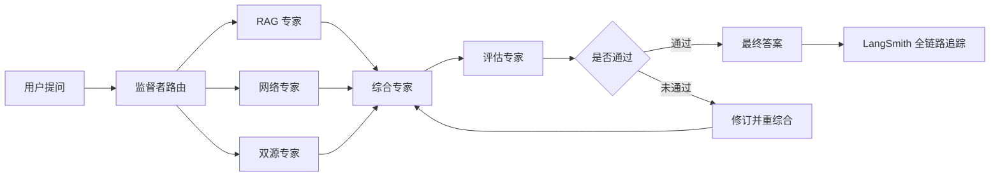

## 1.5 技术挑战清单

| 挑战 | 具体问题 | 不解决的后果 |
|---|---|---|
| 私有知识接入 | 如何让模型读到并引用本地文档 | 模型只能瞎编 |
| 检索质量 | 语义与关键词如何兼得 | 召回不全或精度不足 |
| 信息时效 | 如何获取最新网络信息 | 答案过时 |
| 多任务编排 | 不同问题需要不同专家 | 单模型全包质量差 |
| 答案可信 | 如何防止幻觉、如何溯源 | 无法用于决策 |
| 工具复用 | 检索、搜索、计算如何被复用 | 每个客户端重复造轮子 |
| 可观测性 | 如何定位哪一步出错 | 黑盒难调试 |

## 1.6 技术栈总览

| 层级 | 技术 | 作用 |
|---|---|---|
| LLM | Gemini 2.0 Flash | 路由、综合、评估的推理核心 |
| 稠密嵌入 | Gemini Embedding 001 | 768 维语义向量 |
| 稀疏检索 | FastEmbed BM25 | 关键词匹配 |
| 向量数据库 | Qdrant Cloud | 稠密 + 稀疏混合集合存储 |
| 重排序 | BAAI/bge-reranker-base | cross-encoder 二次精排 |
| 编排 | LangGraph | 多智能体状态机 |
| 追踪 | LangSmith | 全链路可观测 |
| 网络搜索 | Tavily | 实时信息 |
| 工具协议 | 自定义 MCP Server | 5 个可复用工具 |
| 文档解析 | Docling | PDF/DOCX 结构化提取 |
| UI | Streamlit | 生产级 Web 界面 |
| 记忆 | SQLite 检查点 | 会话记忆 |
| 部署 | Docker / GitHub Actions | 容器化与 CI/CD |

## 1.7 能力清单（WHAT）

| 序号 | 能力 | 说明 | 优先级 |
|---|---|---|---|
| 1 | 文档导入 | PDF/DOCX/TXT/MD 解析、分块、入库 | P0 |
| 2 | 混合检索 | 稠密 + 稀疏 + RRF 融合 | P0 |
| 3 | 精排 | cross-encoder 重排序 | P0 |
| 4 | 智能路由 | 监督者判断走 RAG / Web / 双源 | P0 |
| 5 | 综合回答 | 双源合并、结构化输出、带引用 | P0 |
| 6 | 质量评估 | 评估-修订循环 | P0 |
| 7 | 可观测 | LangSmith 追踪 | P1 |
| 8 | 工具标准化 | MCP 协议暴露能力 | P1 |
| 9 | 会话记忆 | SQLite 检查点保存历史 | P1 |
| 10 | 知识图谱多跳检索 | Neo4j 实体关系图谱 + 1 跳邻居召回 | P1 |
| 11 | RAGAS 量化评估 | faithfulness 等 4 指标自动评分 | P1 |
| 12 | REST API | FastAPI 暴露 query/ingest/evaluate 接口 | P1 |

---

# 第二章 核心问题推演

## 问题 1：如何让 LLM 基于私有知识回答问题？

### 第一步 WHY：为什么直接问大模型不行？

**业务场景**：你问“我们公司上季度财报里收入同比变化是多少”，模型没有你的财报，只能根据训练数据猜测。

**生活类比**：这就像闭卷考试。模型的知识截止于训练数据，且不包含你的私有文档。直接回答的后果：

- 幻觉：编造不存在的数字和结论
- 过时：训练数据截止日期之后的信息全部缺失
- 无依据：无法指出答案来自哪一页

### 第二步 WHAT：需要什么能力？

| 序号 | 能力 | 说明 | 优先级 |
|---|---|---|---|
| 1 | 私有知识接入 | 让模型能读到用户文档 | P0 |
| 2 | 答案可溯源 | 每个事实能对应来源和页码 | P0 |
| 3 | 信息时效 | 能补充最新网络信息 | P1 |
| 4 | 成本可控 | 不重新训练模型 | P0 |

### 第三步 HOW：三种方案对比

| 方案 | 做法 | 优点 | 缺点 | 是否选择 |
|---|---|---|---|---|
| 方案1：长上下文硬塞 | 把整份文档塞进 prompt | 实现简单 | 超长文档超出上下文、成本高、无关信息干扰 | 不选 |
| 方案2：微调 | 用私有语料训练或微调模型 | 知识内化 | 成本高、知识更新要重新训练、仍会幻觉 | 不选 |
| 方案3：RAG | 检索相关片段再让模型基于片段回答 | 知识实时、可溯源、成本低、天然开卷 | 依赖检索质量 | 选择 |

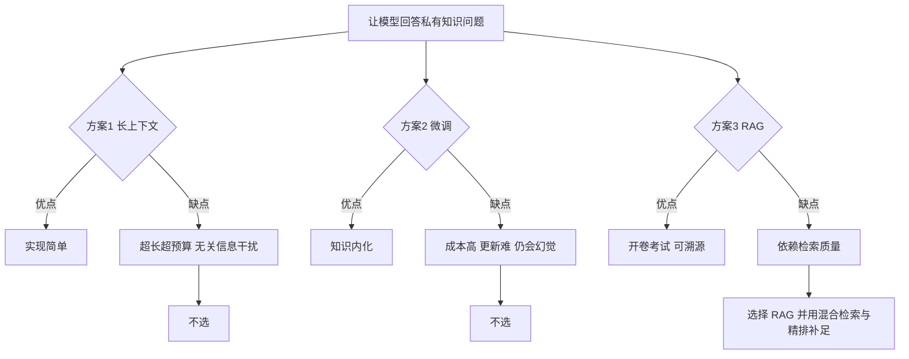

### Trade-off

| 维度 | 牺牲 | 收获 | 是否可接受 |
|---|---|---|---|
| 检索依赖 | 答案质量受检索召回影响 | 知识实时可更新、可溯源 | 可接受，用重排补足 |
| 工程复杂度 | 需要维护向量库和流水线 | 不重新训练、成本低 | 可接受 |

### 第四步 代码落地

##### 错误示范：直接把问题丢给模型

```python
llm.invoke("我们上季度营收同比变化是多少？")
```

为什么错：

1. 模型没有你的财报数据
2. 无法给出来源和页码
3. 大概率编造数字

##### 正确示范：检索增强

```python
# app/agents/rag_agent.py 的核心思路
docs = retriever.get_relevant_documents(query)   # 1. 从私有知识库检索
context = format_with_source(docs)                # 2. 带上 source / page 元数据
answer = llm.invoke(RAG_PROMPT, query, context)  # 3. 基于检索片段回答
```

为什么对：

1. 模型基于真实文档片段作答，幻觉大幅减少
2. 每个事实可溯源到 来源 + 页码
3. 文档更新只需重新导入，无需重新训练

### 时序图

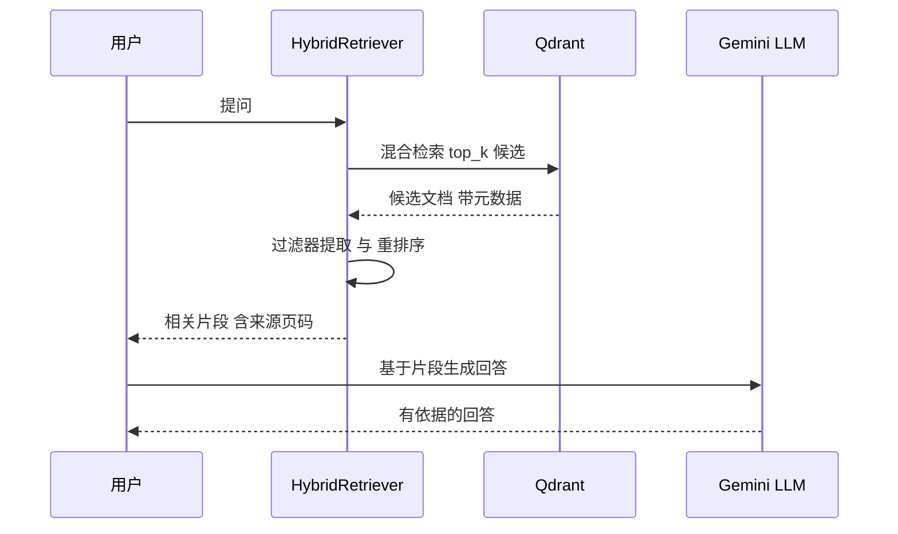

### 面试追问

| 问题 | 回答要点 |
|---|---|
| Q：RAG 和微调能结合吗？ | 可以，先 RAG 解决时效与溯源，微调用于领域风格与格式 |
| Q：检索不到相关内容怎么办？ | RAG Agent 会明确返回未找到相关文档，不硬编 |
| Q：RAG 的缺点是什么？ | 依赖检索质量，片段拼接可能丢失全局上下文，需要精排与上下文窗口设计 |

## 问题 2：如何兼顾语义与关键词的混合检索？

### 第一步 WHY

**业务场景**：用户问“上季度收入是多少”，文档里写的是“Q3 2024 revenue”。

- 纯稠密检索：理解“上季度收入”与“Q3 2024 revenue”语义相近，能召回，但遇到精确术语、编号、缩写时可能漏
- 纯稀疏检索（BM25）：精确匹配 Q3 2024 很强，但“小猫”匹配不到“幼猫”这类语义改写

**生活类比**：稠密检索像按“意思”找书，稀疏检索像按“索引词”找书，两者互补。

### 第二步 WHAT

| 序号 | 能力 | 说明 | 优先级 |
|---|---|---|---|
| 1 | 语义召回 | 理解改写、同义词 | P0 |
| 2 | 精确匹配 | 术语、编号、代码、缩写 | P0 |
| 3 | 融合排序 | 两路结果合成一个排名 | P0 |
| 4 | 结构化过滤 | 按来源、页码、类型过滤 | P1 |

### 第三步 HOW：三种方案对比

| 方案 | 做法 | 优点 | 缺点 | 是否选择 |
|---|---|---|---|---|
| 方案1：仅稠密 | 只用 embedding 向量检索 | 语义强 | 精确词、术语弱 | 不选 |
| 方案2：仅稀疏 | 只用 BM25 关键词 | 精确匹配强 | 语义改写弱 | 不选 |
| 方案3：混合 RRF | dense + sparse 两路召回，倒数秩融合 | 两者互补、实现清晰 | 融合权重需要调优 | 选择 |

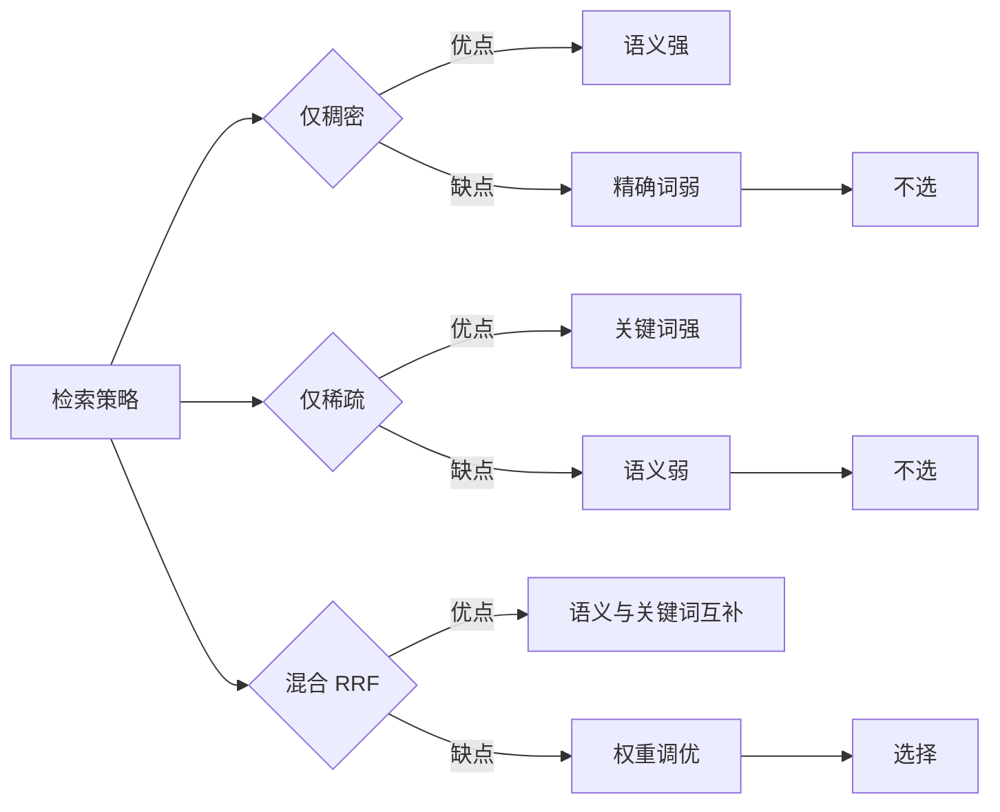

### 混合检索内部流程

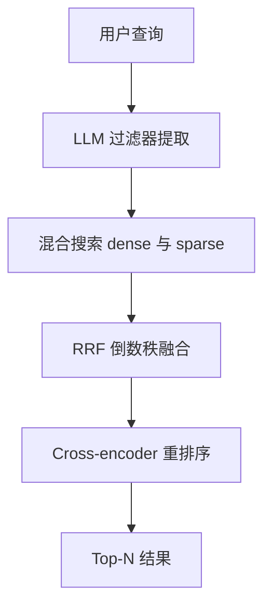

### Trade-off

| 维度 | 牺牲 | 收获 | 是否可接受 |
|---|---|---|---|
| 存储 | 每个分块存稠密 + 稀疏两种向量 | 召回覆盖两种语义 | 可接受 |
| 延迟 | 两路检索 + 融合 | 召回质量显著提升 | 可接受 |

### 第四步 代码落地

##### 错误示范：只用稠密向量

```python
vs.similarity_search(query, k=top_k)
```

为什么错：精确术语、编号、缩写容易漏召回。

##### 正确示范：Qdrant 混合检索

```python
# app/rag/ingestion.py
vs = QdrantVectorStore(
    client=client,
    collection_name=settings.qdrant_collection,
    embedding=get_dense_embeddings(),          # Gemini 768 维稠密向量
    sparse_embedding=get_sparse_embeddings(),  # FastEmbed BM25 稀疏向量
    retrieval_mode=RetrievalMode.HYBRID,       # 混合模式
    vector_name="dense",
    sparse_vector_name="sparse",
)
```

为什么对：

1. dense 与 sparse 两路独立召回
2. Qdrant 内部用 RRF 融合两路排名
3. 集合创建时同时配置稠密向量与稀疏向量

### 附加设计：LLM 过滤器提取与多查询扩展

| 设计 | 作用 | 实现要点 |
|---|---|---|
| 过滤器提取 | 从自然语言提取 source / content_type / page | RAGFilters 结构化输出，仅用户明确提到才设置 |
| 多查询扩展 | 生成查询变体扩大召回 | MultiQueryRetriever，md5 去重 |

### 面试追问

| 问题 | 回答要点 |
|---|---|
| Q：RRF 是什么？ | 两路结果的排名倒数相加，不依赖分数尺度 |
| Q：过滤器提取失败会怎样？ | try-except 兜底返回空过滤器，不影响主流程 |
| Q：混合检索的代价？ | 存储翻倍、两路检索延迟，换取召回质量 |

---

## 问题 3：如何提升检索相关性（重排序）？

### 第一步 WHY

**业务场景**：混合检索召回 top-10，里面可能只有 3 个真正相关。直接把 10 个片段塞给模型，会引入噪声，模型容易被不相关内容带偏。

**生活类比**：海选简历（召回）之后还需要业务主管精挑（精排），不能直接全部录用。

### 第二步 WHAT

| 序号 | 能力 | 说明 | 优先级 |
|---|---|---|---|
| 1 | 二次精排 | 对候选逐对打分 | P0 |
| 2 | 分数可透出 | 重排分数写入元数据 | P1 |
| 3 | 降级兜底 | 模型加载失败不阻塞主流程 | P0 |

### 第三步 HOW：三种方案对比

| 方案 | 做法 | 优点 | 缺点 | 是否选择 |
|---|---|---|---|---|
| 方案1：直接截断 | 取 top-N 不重排 | 零成本 | 相关片段可能排后面 | 不选 |
| 方案2：云端重排 API | 调 Cohere 等 rerank 接口 | 效果好 | 付费、依赖外部 | 不选 |
| 方案3：本地 cross-encoder | BAAI/bge-reranker-base 本地打分 | 免费、效果接近 API、离线可用 | 首次需下载模型 | 选择 |

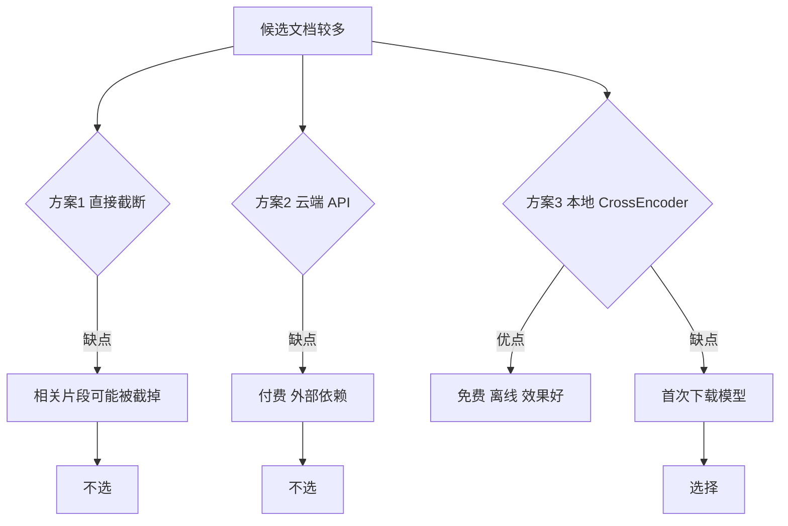

### Trade-off

| 维度 | 牺牲 | 收获 | 是否可接受 |
|---|---|---|---|
| 首次启动 | 需要下载 BAAI/bge-reranker-base | 之后本地打分零 API 成本 | 可接受 |
| 延迟 | 每查询多一次模型推理 | 喂给模型的内容更相关 | 可接受 |

### 第四步 代码落地

##### 错误示范：不重排直接喂模型

```python
context = "\n".join(doc.page_content for doc in candidates[:5])
```

为什么错：候选排名来自融合分数，不代表与查询最相关，噪声片段会误导模型。

##### 正确示范：CrossEncoder 重排 + 分数透出

```python
# app/rag/reranker.py
pairs = [(query, doc.page_content) for doc in documents]
scores = model.predict(pairs)
scored = sorted(zip(scores, documents), key=lambda x: x[0], reverse=True)
for score, doc in scored[: self.top_n]:
    doc.metadata["rerank_score"] = float(score)   # 分数透出到元数据
```

为什么对：

1. query 与每个候选逐对打分，相关性判断更准
2. 分数写入元数据，RAG Agent 可以展示给用户
3. 单例懒加载，模型失败时优雅降级为截断

### 面试追问

| 问题 | 回答要点 |
|---|---|
| Q：bi-encoder 与 cross-encoder 区别？ | bi-encoder 预先向量化、快但粗；cross-encoder 逐对精算、准但慢 |
| Q：为什么用懒加载单例？ | 模型加载一次复用，避免每次查询重复加载 |
| Q：重排模型失败怎么办？ | 返回截断的 top-N，日志告警，不阻塞主流程 |

---

## 问题 4：如何编排多个专家 Agent？

### 第一步 WHY

**业务场景**：查询类型差异很大：

- “文档里的关键发现是什么”，需要 RAG
- “今天 AI 圈有什么新闻”，需要 Web
- “文档与最新新闻对比”，需要双源

单模型一把梭：一个 prompt 做所有事，指令互相干扰，链路不可控。

**生活类比**：一家医院多科室会诊，比一个全科医生处理所有疑难杂症更可靠。

### 第二步 WHAT

| 序号 | 能力 | 说明 | 优先级 |
|---|---|---|---|
| 1 | 智能路由 | 根据查询选择专家 | P0 |
| 2 | 状态传递 | 各节点共享上下文 | P0 |
| 3 | 循环控制 | 评估不通过时回退 | P0 |
| 4 | 会话记忆 | 多轮对话上下文 | P1 |
| 5 | 可观测 | 每步可追踪 | P1 |

### 第三步 HOW：编排方案对比

| 方案 | 做法 | 优点 | 缺点 | 是否选择 |
|---|---|---|---|---|
| 方案1：单体 prompt | 一个模型处理全部 | 简单 | 指令冲突、难调试、难扩展 | 不选 |
| 方案2：手写 pipeline | if-else 串起各步骤 | 可控 | 状态管理复杂、扩展困难、代码意大利面 | 不选 |
| 方案3：LangGraph 状态机 | 节点 + 边 + 条件路由 | 结构清晰、可循环、可检查点、可追踪 | 需要学习图模型 | 选择 |

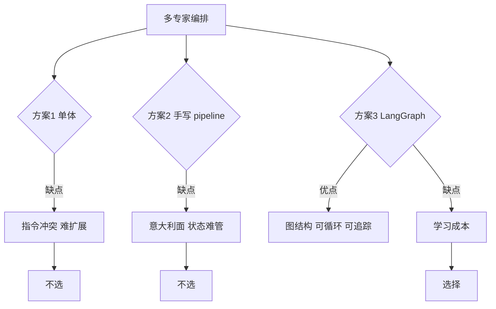

### 监督者路由方案对比

| 方案 | 做法 | 优点 | 缺点 | 是否选择 |
|---|---|---|---|---|
| 方案1：规则路由 | 关键词判断 | 快、可预测 | 长尾查询判断不准 | 不选 |
| 方案2：LLM 路由 | 监督者 prompt 输出一个专家名 | 理解语义 | 偶尔输出非法值 | 选择，加兜底 |
| 方案3：规则 + LLM | 混合判断 | 稳 | 复杂 | 可选演进 |

本项目实现：监督者 prompt 要求输出 rag_agent / web_agent / both / synthesis，代码中对非法值兜底为 both。

### Trade-off

| 维度 | 牺牲 | 收获 | 是否可接受 |
|---|---|---|---|
| 延迟 | 多一次 LLM 路由调用 | 查询分到最合适的专家 | 可接受 |
| 复杂度 | 图、状态、检查点概念 | 清晰、可扩展、可循环 | 可接受 |

### 第四步 代码落地

##### 错误示范：if-else 意大利面

```python
if "文档" in query:
    answer = rag(query)
elif "新闻" in query:
    answer = web(query)
else:
    answer = both(query)
```

为什么错：规则覆盖不了语义改写；状态、循环、记忆都要手写。

##### 正确示范：LangGraph 图状态机

```python
# app/graph/workflow.py
graph = StateGraph(AgentState)
graph.add_node("supervisor", supervisor_node)
graph.add_node("rag_node", rag_node)
graph.add_node("web_node", web_node)
graph.add_node("synthesis_node", synthesis_node)
graph.add_node("critique_node", critique_node)
graph.add_edge(START, "supervisor")
graph.add_conditional_edges("supervisor", route_supervisor, {...})
graph.add_conditional_edges("critique_node", route_critique,
                            {"synthesis_node": "synthesis_node", "end": END})
```

为什么对：

1. 每个专家是独立节点，职责单一
2. 条件边实现路由与评估循环
3. SqliteSaver 检查点让多轮对话可恢复

### 整体工作流

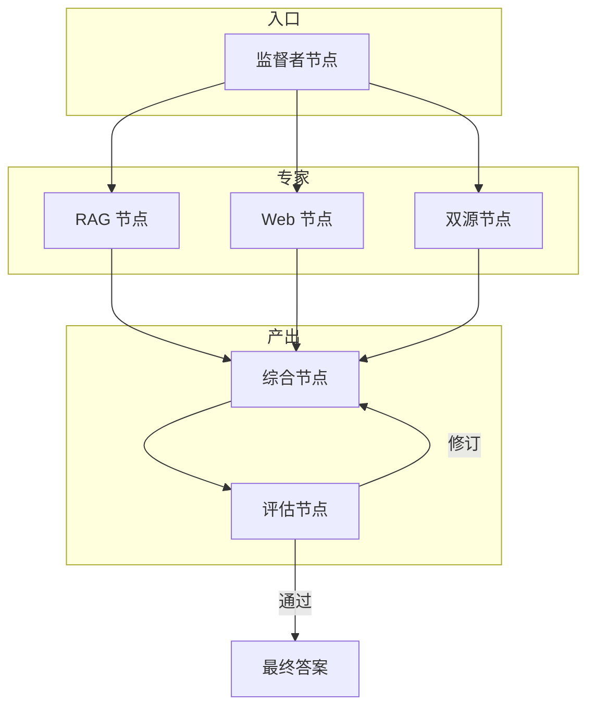

### 状态流转

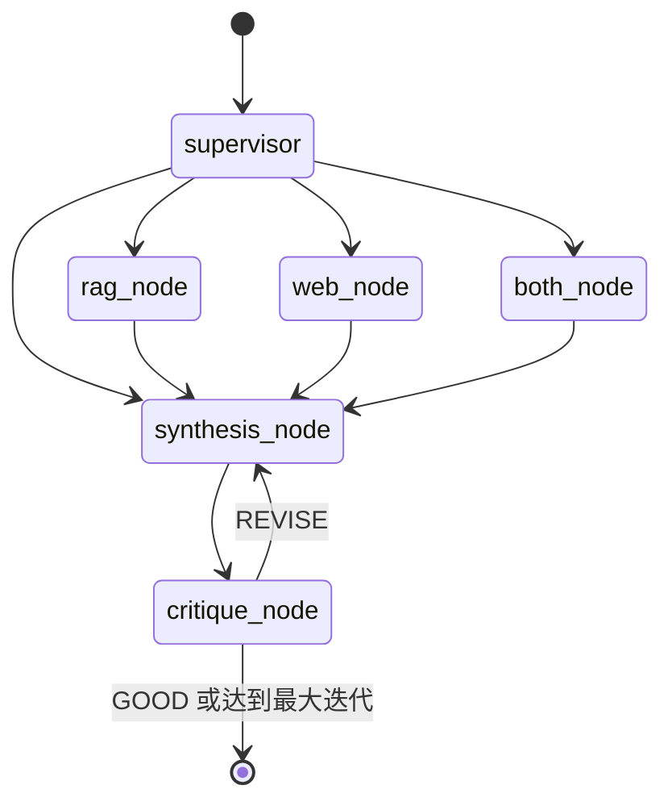

### 面试追问

| 问题 | 回答要点 |
|---|---|
| Q：both_node 是并行吗？ | 当前顺序执行 RAG 再 Web，代码注释说明并行需要异步 LangGraph |
| Q：为什么用 TypedDict 状态？ | 类型提示清晰，add_messages 处理消息累积 |
| Q：如何防止评估死循环？ | MAX_ITERATIONS 上限 + GOOD 判定双重退出 |

---

## 问题 5：如何保障答案质量与可观测性？

### 第一步 WHY

**业务场景**：LLM 一次生成可能不完整、有幻觉、结构混乱。如果直接把答案交给用户，错误信息会损害信任。同时，多智能体链路像一个黑盒，出错时不知道是哪一步。

**生活类比**：写文章要经历初稿、校对、修改三轮打磨，发布前还要有存档记录（追踪）。

### 第二步 WHAT

| 序号 | 能力 | 说明 | 优先级 |
|---|---|---|---|
| 1 | 忠实性检查 | 每个结论都有上下文依据 | P0 |
| 2 | 完整性检查 | 完整回答用户问题 | P0 |
| 3 | 准确性检查 | 数字、日期、事实正确 | P0 |
| 4 | 修订循环 | 不合格时给出具体修改意见并重写 | P0 |
| 5 | 全链路追踪 | 记录每个节点的输入输出 | P1 |

### 第三步 HOW：质量保障方案对比

| 方案 | 做法 | 优点 | 缺点 | 是否选择 |
|---|---|---|---|---|
| 方案1：不评估 | 一次生成直接输出 | 快 | 幻觉与遗漏无法拦截 | 不选 |
| 方案2：规则启发式 | 检查长度、关键词 | 快 | 判断不了语义质量 | 不选 |
| 方案3：LLM 批评循环 | 评估 Agent 打分，REVISE 时回退重写 | 语义级质检、可解释 | 多一次模型调用 | 选择 |

### 追踪方案对比

| 方案 | 做法 | 优点 | 缺点 | 是否选择 |
|---|---|---|---|---|
| 方案1：print 日志 | 代码里打点 | 零依赖 | 难串联、无 UI | 不选 |
| 方案2：手动埋点 | 自建 trace 库 | 可控 | 工作量大 | 不选 |
| 方案3：LangSmith | 自动捕获 LangChain 调用 | 零侵入、可视化 | 免费额度限制 | 选择 |

### Trade-off

| 维度 | 牺牲 | 收获 | 是否可接受 |
|---|---|---|---|
| 延迟 | 每次查询最多多几次 LLM 调用 | 答案可信度显著提升 | 可接受 |
| 成本 | 评估与重写消耗 token | 语义级质量保障 | 可接受 |

### 第四步 代码落地

##### 错误示范：一次生成直接输出

```python
answer = llm.invoke(query)
return answer
```

为什么错：没有质量关卡，幻觉、遗漏直接暴露给用户。

##### 正确示范：评估-修订循环

```python
# app/graph/workflow.py critique_node
if "GOOD" in critique.upper() or iterations >= settings.max_iterations:
    final = state["draft_answer"]   # 通过或达到上限 → 结束
else:
    final = ""                       # 回退到 synthesis_node 重写
```

为什么对：

1. 评估标准明确：忠实性、完整性、准确性、清晰度
2. REVISE 携带具体修改指令，指导综合节点重写
3. 最大迭代次数兜底，避免死循环

### 评估循环时序

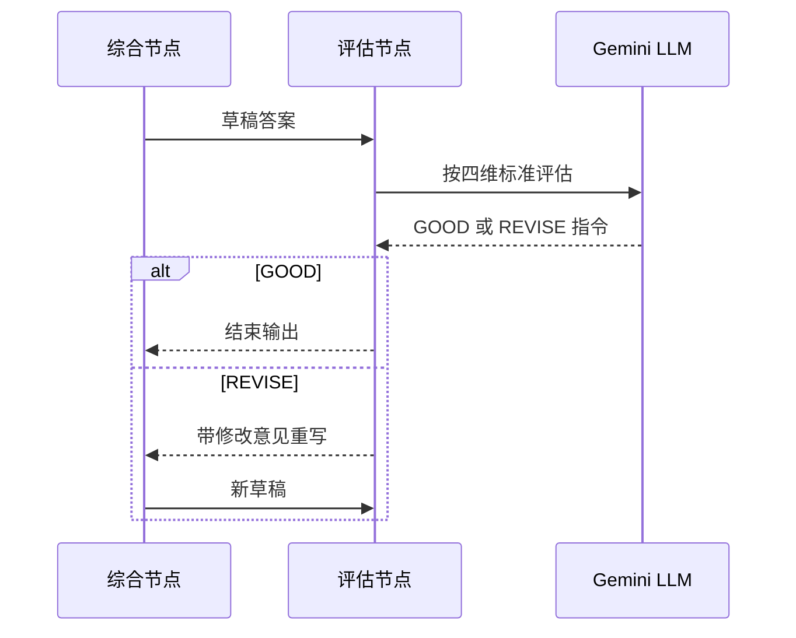

### 面试追问

| 问题 | 回答要点 |
|---|---|
| Q：评估 Agent 用什么 prompt 标准？ | 忠实性、完整性、准确性、清晰度四维 |
| Q：评估本身会幻觉怎么办？ | 上下文截断 4000 字符控制预算，标准明确，且只做质量门禁 |
| Q：LangSmith 追踪什么？ | 每个节点调用、token、耗时、工具调用 |

---

## 问题 6：如何做知识图谱多跳检索？

### 第一步 WHY：为什么需要知识图谱？

**业务场景**：用户问"GPT-4 和 Gemini 都被哪些公司开发，它们又分别属于哪个国家"，文档里散落着"OpenAI 开发了 GPT-4"、"Microsoft 投资了 OpenAI"、"Google 推出了 Gemini"、"Gemini 属于美国"等片段。

- 纯向量检索：能召回语义相近的单个片段，但无法跨片段拼接"实体 → 关系 → 实体"的多跳链路
- 纯关键词检索：精确匹配"OpenAI"、"GPT-4"很强，但不知道它们之间存在"开发"关系
- 综合：单段语义召回很强，多跳关系推理弱

**生活类比**：向量检索像按"意思相近"找单页笔记，知识图谱像查"人际关系网"——一个朋友连着另一个朋友，能顺着链路把跨页面的关系串起来。

### 第二步 WHAT：需要什么能力？

| 序号 | 能力 | 说明 | 优先级 |
|---|---|---|---|
| 1 | 实体关系抽取 | LLM 从文档抽取 (head, relation, tail) 三元组 | P0 |
| 2 | 图谱构建 | 写入 Neo4j，MERGE 避免重复 | P0 |
| 3 | 多跳检索 | 从 query 关键词找相关实体 + 1 跳邻居 | P0 |
| 4 | 三路融合 | 与 dense/sparse 结果 MD5 去重并入候选池 | P0 |
| 5 | 降级兜底 | Neo4j 不可用时静默跳过 | P0 |

### 第三步 HOW：三种方案对比

| 方案 | 做法 | 优点 | 缺点 | 是否选择 |
|---|---|---|---|---|
| 方案1：纯向量多段召回 | 召回 top-K 后拼成图 | 零额外存储 | 多跳关系靠 LLM 后处理拼，易漏 | 不选 |
| 方案2：全量图数据库 | 文档全部建图，全图遍历 | 关系强 | 实体归一化难、噪声大、查询慢 | 不选 |
| 方案3：增量图 + 1 跳邻居 | 文档入库时 LLM 抽三元组建图，检索时按 query 关键词找实体+1 跳邻居 | 平衡精度与延迟，与向量互补 | 抽取有 token 成本、归一化靠 prompt | 选择 |

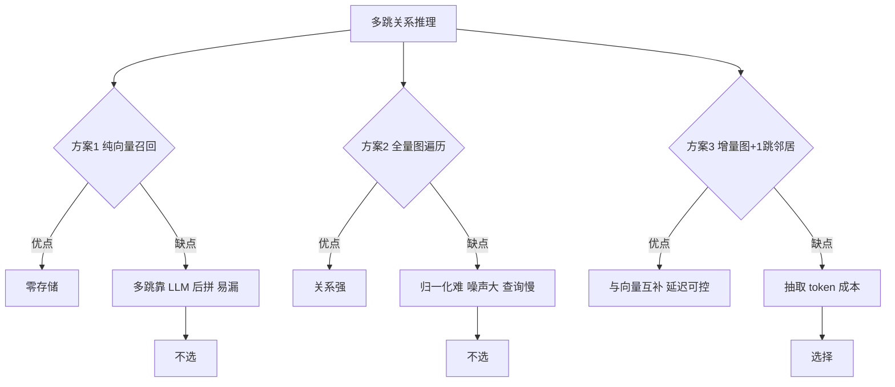

### Trade-off

| 维度 | 牺牲 | 收获 | 是否可接受 |
|---|---|---|---|
| 入库延迟 | 每个 chunk 多一次 LLM 抽取调用 | 多跳关系可推理 | 可接受，异步增量 |
| 实体归一化 | 同义实体可能重复节点 | MERGE + prompt 规范化缓解 | 可接受 |
| 检索延迟 | 多一次 Neo4j 查询 | 召回多跳关系片段 | 可接受 |

### 第四步 代码落地

##### 错误示范：纯向量召回硬凑多跳

```python
docs = vs.similarity_search(query, k=top_k)
# LLM 自己从 docs 里拼关系
```

为什么错：跨片段关系推理交给 LLM，幻觉风险高，且 top_k 截断容易漏掉关键关系片段。

##### 正确示范：增量图 + 1 跳邻居

```python
# app/rag/kg.py 核心思路
def build_knowledge_graph(documents):
    driver = get_driver()              # 1. 懒加载 Neo4j driver
    for doc in documents:
        result = _extract_with_llm(doc.page_content)  # 2. LLM 抽实体+关系
        with driver.session() as s:
            s.execute_write(_cypher_merge,            # 3. MERGE 节点+边
                            result.entities, result.relations, source)

def kg_retrieve(query, top_k):
    driver = get_driver()
    keywords = _extract_keywords(query)  # 4. 从 query 抽关键词
    with driver.session() as s:
        result = s.run(KG_CYPHER, keywords=keywords, k=top_k).data()
    # 5. 返回 Document 列表，metadata 含 head/relation/tail
    return [Document(page_content=r["text"], metadata={...}) for r in result]
```

为什么对：

1. 文档入库时同步建图，关系永久保存
2. 检索时按 query 关键词定位实体，再 1 跳扩展邻居，关系链路清晰
3. MERGE 保证幂等，重复导入不会产生重复节点
4. driver 加载失败返回 None，KG 检索静默降级跳过，不阻塞主流程

### 图检索内部流程

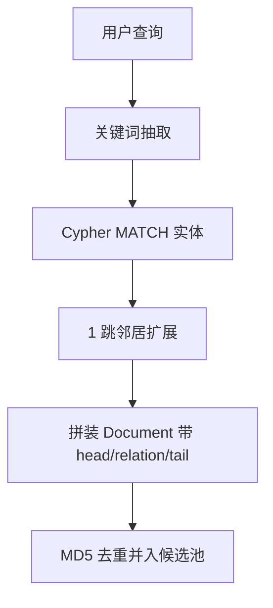

### 面试追问

| 问题 | 回答要点 |
|---|---|
| Q：为什么不直接用 GraphRAG？ | GraphRAG 全量社区检测成本高，本项目用增量图 + 1 跳邻居，延迟可控 |
| Q：实体归一化怎么做？ | prompt 强制规范化（GPT-4、GPT4 统一为 GPT-4）+ Neo4j MERGE 幂等 |
| Q：Neo4j 挂了怎么办？ | get_driver 返回 None，retriever 步骤 2b 跳过，向量检索继续 |
| Q：图检索和向量检索怎么融合？ | 三路候选 MD5 去重，再进 cross-encoder 统一精排 |

---

## 问题 7：如何做 RAGAS 量化评估？

### 第一步 WHY：为什么需要 RAGAS？

**业务场景**：上线后用户反馈"答案有时准有时不准"，但 LangSmith 只能看链路，无法给一个量化分数来横向对比 prompt/检索参数迭代效果。

- 人工评估：主观、慢、不可复现
- 单看 LangSmith trace：能看过程，但没有 faithfulness/context_precision 这类标准化分数
- Self-Critique 循环：是质量门禁，不是离线评估指标

**生活类比**：LangSmith 是行车记录仪，RAGAS 是车辆年检——前者记录每趟行程，后者给出可对比的量化分数。

### 第二步 WHAT：需要什么能力？

| 序号 | 能力 | 说明 | 优先级 |
|---|---|---|---|
| 1 | 评估数据集 | 自动生成 (query, ground_truth) 对 | P0 |
| 2 | 4 维指标 | faithfulness / answer_relevancy / context_precision / context_recall | P0 |
| 3 | judge LLM | Gemini 作评估 LLM | P0 |
| 4 | 接口暴露 | FastAPI /api/evaluate 触发 | P1 |

### 第三步 HOW：三种评估方案对比

| 方案 | 做法 | 优点 | 缺点 | 是否选择 |
|---|---|---|---|---|
| 方案1：人工标注评估 | 人写 ground_truth + 打分 | 贴近真实 | 慢、不可复现、主观 | 不选 |
| 方案2：LangSmith 评估数据集 | 在 LangSmith 平台标注 + 跑评估 | 与追踪集成 | 指标自定义弱、平台依赖 | 不选 |
| 方案3：RAGAS 框架 | 自动生成数据集 + 4 维标准指标 + Gemini judge | 标准化、可复现、可对比 | judge LLM 本身有成本 | 选择 |

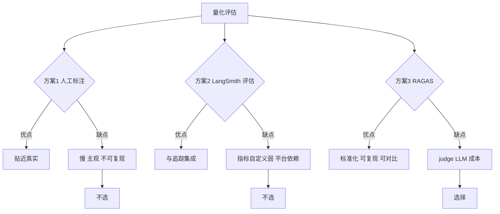

### Trade-off

| 维度 | 牺牲 | 收获 | 是否可接受 |
|---|---|---|---|
| judge 成本 | 评估时多一次 Gemini 调用 | 4 维标准分数可对比 | 可接受，离线批量跑 |
| 数据集质量 | LLM 自动生成 ground_truth 有噪声 | 无需人工标注 | 可接受，抽样校验 |

### 第四步 代码落地

##### 错误示范：只看 LangSmith trace 拍脑袋

```python
# 在 LangSmith 平台肉眼看每次 trace 凭感觉打分
```

为什么错：主观、不可复现、无法横向对比 prompt 迭代效果。

##### 正确示范：RAGAS 4 维评估

```python
# app/rag/evaluation.py 核心思路
from ragas import evaluate
from ragas.metrics import (
    faithfulness, answer_relevancy,
    context_precision, context_recall,
)

def generate_eval_dataset(n):
    docs = vectorstore.similarity_search("评估采样", k=20)
    samples = []
    for doc in docs[:n]:
        q = llm.invoke(GEN_QUERY_PROMPT, doc=doc.page_content)  # LLM 生成问题
        samples.append({"question": q, "ground_truth": doc.page_content})
    return samples

def run_ragas_evaluation(samples):
    # 1. 对每个 sample 跑一次 RAG 流水线，拿 answer + contexts
    # 2. 组装 Dataset，调 ragas.evaluate
    result = evaluate(
        dataset,
        metrics=[faithfulness, answer_relevancy,
                 context_precision, context_recall],
        llm=ChatGoogleGenerativeAI(model=settings.gemini_model),
        embeddings=get_dense_embeddings(),
    )
    return result.to_pandas()
```

为什么对：

1. 4 个指标覆盖"答案是否忠实于上下文 / 答案是否切题 / 上下文是否精准 / 上下文是否完整"
2. judge LLM 用 Gemini，与生产 LLM 同源，避免跨模型偏差
3. 数据集自动生成，无需人工标注即可离线批量跑
4. 返回 pandas DataFrame，方便横向对比不同参数版本

### 评估流程时序

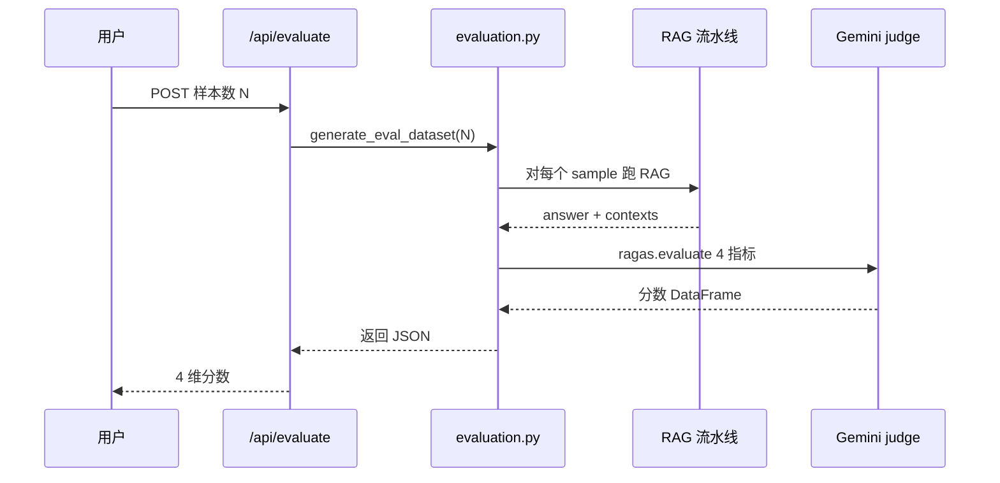

### 面试追问

| 问题 | 回答要点 |
|---|---|
| Q：RAGAS 和 Self-Critique 循环冲突吗？ | 不冲突，Self-Critique 是在线质量门禁，RAGAS 是离线量化评估 |
| Q：4 个指标分别衡量什么？ | faithfulness 忠实性 / answer_relevancy 切题性 / context_precision 上下文精准 / context_recall 上下文召回 |
| Q：judge LLM 用 Gemini 还是 GPT？ | 用 Gemini，与生产 LLM 同源避免跨模型偏差 |
| Q：评估数据集怎么来？ | LLM 从已导入文档自动生成 (query, ground_truth) 对，无需人工标注 |

---

# 第三章 方案设计总结

## 3.1 核心决策对照表

| 问题 | 最终方案 | 为什么不用其他 | Trade-off |
|---|---|---|---|
| 私有知识 | RAG 检索增强 | 微调成本高、长上下文超预算 | 依赖检索质量 |
| 检索方式 | Qdrant 混合 dense + sparse + RRF | 单路召回覆盖不全 | 存储与延迟翻倍 |
| 相关性 | 本地 cross-encoder 精排 | API 付费、直接截断会漏 | 首次下载模型 |
| 编排 | LangGraph 状态机 | 单体 prompt 与 if-else 难维护 | 图模型学习成本 |
| 路由 | LLM 监督者 + 非法值兜底 | 纯规则覆盖不了语义 | 多一次 LLM 调用 |
| 质量 | LLM 评估-修订循环 | 规则判断不了语义 | 额外 token 与延迟 |
| 追踪 | LangSmith | 自建埋点工作量大 | 免费额度限制 |
| 工具 | MCP Server | 直接函数调用无法跨客户端复用 | 需维护协议层 |
| 记忆 | SQLite 检查点 | Redis 增加运维 | 本地单机够用 |
| 多跳关系 | Neo4j 增量图 + 1 跳邻居 | GraphRAG 全量社区检测成本高 | 抽取 token 成本 |
| 量化评估 | RAGAS 4 维 + Gemini judge | 人工主观、LangSmith 指标弱 | judge LLM 成本 |
| 接口 | FastAPI 双入口 | 单 Streamlit 入口无法对接外部系统 | 维护两套入口 |

## 3.2 整体架构图

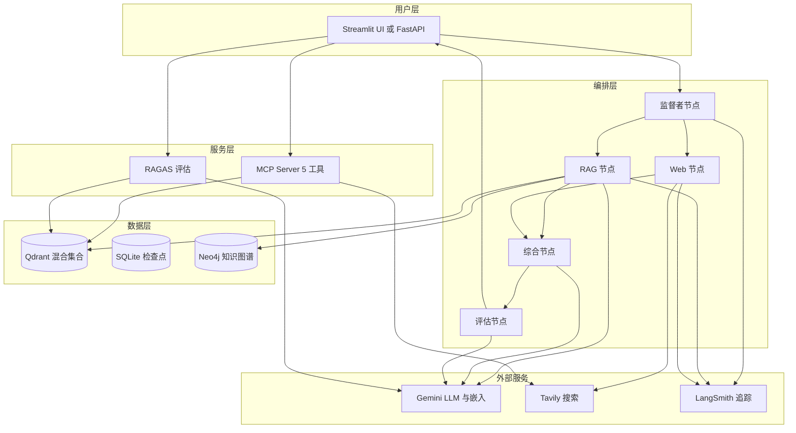

## 3.3 数据流转时序（文档导入链路）

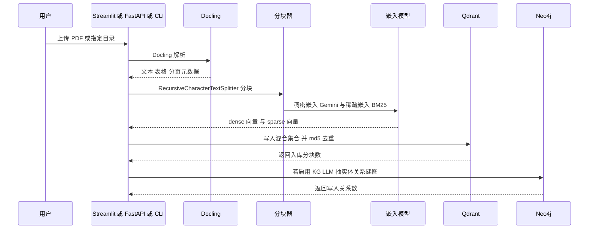

## 3.4 数据模型

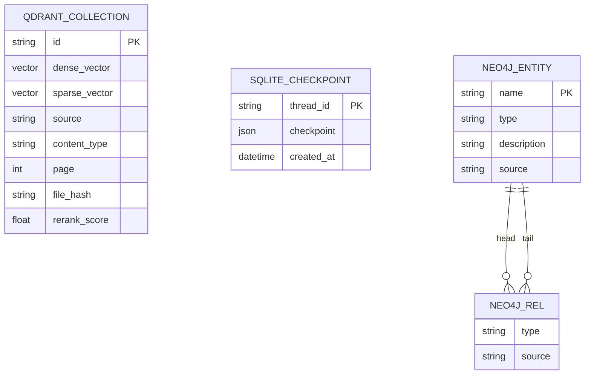

| 对象 | 字段 | 说明 |
|---|---|---|
| Qdrant 集合 | dense | 768 维稠密向量，COSINE 距离 |
| Qdrant 集合 | sparse | BM25 稀疏向量 |
| Qdrant 集合 | source | 文档名或来源 |
| Qdrant 集合 | content_type | text / table / image |
| Qdrant 集合 | page | 页码 |
| Qdrant 集合 | file_hash | 文件级去重 |
| SQLite | thread_id | 会话标识 |
| SQLite | checkpoint | LangGraph 图状态快照 |
| Neo4j Entity | name | 规范化实体名，MERGE 幂等 |
| Neo4j Entity | type | Person / Org / Concept / Location / Tech |
| Neo4j Entity | source | 来源文档名 |
| Neo4j REL | type | 关系名称（开发了/属于/涉及/包含） |
| Neo4j REL | source | 来源文档名 |

## 3.5 MCP 工具层设计

| 工具 | 输入 | 输出 | 安全设计 |
|---|---|---|---|
| hybrid_search | query, top_k | 相关文档块 | 复用混合检索链路 |
| web_search | query, max_results | 实时网络结果 | Tavily 免费额度限制 |
| summarise_docs | documents, focus | 摘要段落 | 截断前 8 篇 |
| extract_entities | text | 人物或组织或日期或数字 | 截断 3000 字符 |
| calculate | expression | 数学结果 | AST 白名单，拒绝 eval |

---

# 第四章 完整链路串联

## 4.1 完整时序图

```mermaid
sequenceDiagram
    participant U as 用户
    participant S as 监督者
    participant R as RAG 专家
    participant W as Web 专家
    participant Y as 综合专家
    participant C as 评估专家
    U->>S: 提问
    S->>S: LLM 判断路由
    alt rag_agent
        S->>R: 走 RAG
        R->>R: 混合检索 过滤 重排
    else web_agent
        S->>W: 走 Web
        W->>W: Tavily 搜索
    else both
        S->>R: RAG
        S->>W: Web
    end
    R-->>Y: 知识库上下文
    W-->>Y: 网络上下文
    Y->>Y: 双源合并生成草稿
    Y->>C: 评估
    C-->>Y: REVISE 时回退重写
    C-->>U: GOOD 输出最终答案
    Note over S,R,W,Y,C: 每步写入 LangSmith
```

## 4.2 状态流转图

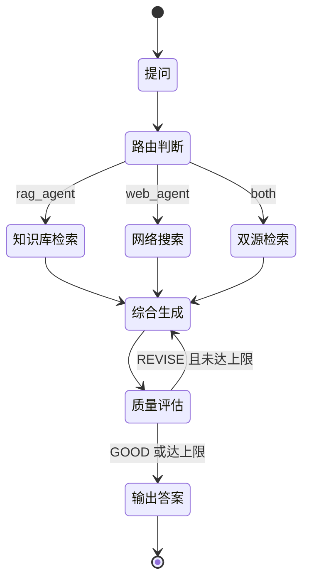

## 4.3 异常场景与兜底

| 场景 | 影响 | 兜底处理 |
|---|---|---|
| 知识库无相关文档 | RAG 返回空上下文 | RAG Agent 明确返回未找到 |
| Tavily 搜索失败 | Web 无结果 | Web Agent 返回错误信息，综合节点继续 |
| 重排模型加载失败 | 精排失效 | 降级为截断 top-N |
| 过滤器提取失败 | 无结构化过滤 | try-except 返回空过滤器 |
| 评估一直 REVISE | 死循环 | MAX_ITERATIONS 上限强制结束 |
| LLM 路由输出非法值 | 路由失败 | 兜底路由到 both |
| 重复导入同一文档 | 向量库膨胀 | md5 去重 |
| 文件过大 | 内存压力 | 分块导入，Streamlit 上传限制 |

## 4.4 优化点清单

| 方向 | 现状 | 可改进 |
|---|---|---|
| 并行 | both_node 顺序执行 | 异步 LangGraph 并行 RAG + Web |
| 输出 | 一次性返回 | SSE 流式响应 |
| 缓存 | 无 | Redis 缓存重复查询 |
| 多模态 | 支持表格与文本 | RAG 中的图像理解 |
| 知识图谱 | [x] 已接入 Neo4j 增量图 | 进一步做社区检测与多跳推理 |
| 评估 | [x] 已接 RAGAS 4 维 | 扩展为 A/B 对比基线 |
| 隔离 | 全局集合 | 多用户会话隔离 |

---

# 第五章 测试验证

## 5.1 功能测试用例

| 测试类 | 用例 | 验证点 |
|---|---|---|
| CrossEncoderReranker | 返回 top-N | 只返回指定数量，最高分排第一 |
| CrossEncoderReranker | 空文档 | 返回空列表不报错 |
| CrossEncoderReranker | 模型加载失败 | 降级截断仍返回 top-N |
| MCP calculate | 基础运算 | 2 + 2 = 4 |
| MCP calculate | 复杂表达式 | 括号与优先级正确 |
| MCP calculate | 非法表达式 | import os 被拒绝 |
| MCP calculate | 幂运算 | 2 的 10 次方 = 1024 |
| Ingestion | 去重 | 相同内容只入库一次 |
| Ingestion | 文本分块 | 元数据 source 与 content_type 正确 |
| AgentRouting | 路由到 rag | rag_agent → rag_node |
| AgentRouting | 路由到 web | web_agent → web_node |
| AgentRouting | 路由到 both | both → both_node |
| AgentRouting | 评估通过结束 | final_answer 非空 → end |
| AgentRouting | 评估失败循环 | final_answer 为空 → synthesis_node |

## 5.2 边界场景验证

| 边界场景 | 预期行为 |
|---|---|
| 空知识库提问 | RAG Agent 提示未找到相关文档 |
| 上传重复文件 | 去重后不重复入库 |
| 超长文档 | 按 chunk_size 与 overlap 分块 |
| 评估持续 REVISE | 达到最大迭代强制输出 |
| 非法路由输出 | 兜底为 both |
| 模型不可用 | 各 Agent 捕获异常并返回错误信息 |

## 5.3 CI/CD 流水线

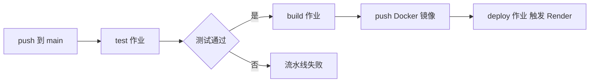

| 作业 | 内容 | 触发条件 |
|---|---|---|
| test | ruff 检查 + pytest | push 或 PR |
| build | Docker Buildx 构建并推 Docker Hub | main 分支且 test 通过 |
| deploy | curl Render webhook | main 分支且 build 完成 |

## 5.4 本地验证步骤

| 步骤 | 命令 | 验证点 |
|---|---|---|
| 安装依赖 | pip install -r requirements.txt | 依赖可解析 |
| 运行测试 | pytest tests/ -v | 测试全绿 |
| 导入文档 | python scripts/ingest.py --file data/demo.pdf | 分块数输出 |
| 启动 UI | streamlit run app/main.py | 8501 端口可访问 |
| 提问验证 | 聊天框提问 | 路由徽章、来源、追踪链接显示 |

---

# 第六章 总结与提升

## 6.1 架构设计亮点

| 亮点 | 说明 |
|---|---|
| 专家分工 | 路由、检索、搜索、综合、评估各司其职 |
| 图状编排 | LangGraph 让链路可视化、可循环、可检查点 |
| 混合检索 + 精排 | 召回与精度两手抓 |
| 自我批评闭环 | 质量门禁 + 修订循环 + 最大迭代兜底 |
| 工具协议化 | MCP 让能力可被任意客户端复用 |
| 全链路可观测 | LangSmith 每步可追溯 |
| 工程化完备 | 测试、CI/CD、Docker、非 root 运行 |

## 6.2 可改进点

| 改进方向 | 收益 | 对应路线图 |
|---|---|---|
| 异步并行执行 | 双源查询延迟降低 | 第一项 |
| 流式输出 | 首字延迟降低 | 第二项 |
| 多模态检索 | 支持图像理解 | 第三项 |
| Graph RAG | 实体关系推理 | 第四项 |
| 评估数据集 | 自动化质量回归 | 第五项 |

## 6.3 技术债与风险

| 项 | 现状 | 风险 |
|---|---|---|
| both_node 顺序执行 | 串行跑 RAG 再 Web | 延迟偏高 |
| 单测依赖 mock | 未覆盖真实 API 集成 | 回归可能漏网 |
| 重排模型首次下载 | 启动时需要联网拉模型 | 冷启动慢 |
| 过滤器提取依赖 LLM | 多一次模型调用 | 延迟与成本 |
| 免费额度限制 | Gemini、Tavily、LangSmith 免费层 | 高并发受限 |

## 6.4 学习收获总结

- 通过源码阅读理解了混合 RAG 的完整链路：解析、分块、双嵌入、混合检索、重排、合成、评估
- 掌握了 LangGraph 状态机在多智能体编排中的应用：节点、条件边、检查点、循环
- 理解了质量闭环设计：评估标准、修订指令、最大迭代兜底
- 理解了工具协议化：MCP Server 如何把检索、搜索、计算暴露为标准化工具
- 梳理了可观测性设计：LangSmith 与结构化元数据如何支撑调试与复盘
- 本地可复现：pytest 全绿、Docker 构建、Streamlit 启动全流程可验证

## 6.5 面试话术

### 架构类

| 问题 | STAR 回答 | 技术细节 |
|---|---|---|
| Q：请介绍你做的多智能体系统 | 背景是研究问答场景，需要同时处理私有文档与实时信息；设计了监督者路由加五个专家节点；链路清晰可追踪 | LangGraph 节点边、TypedDict 状态、SqliteSaver |
| Q：为什么用多智能体而不是单体 | 单体 prompt 指令冲突，多智能体各司其职、可独立优化 | 路由、RAG、Web、综合、评估五节点 |
| Q：多智能体之间如何通信 | 共享 AgentState，消息用 add_messages 累积 | TypedDict + 图状态 |
| Q：如何保证系统可维护 | 节点单一职责、条件边显式、测试覆盖路由 | 14 个测试、CI/CD |
| Q：如何做系统演进 | 路线图明确：异步、流式、GraphRAG | 新增节点只需加边 |

### 技术选型类

| 问题 | STAR 回答 | 技术细节 |
|---|---|---|
| Q：为什么选 RAG 而不是微调 | 私有知识实时更新、可溯源、成本低 | 检索增强 + 引用元数据 |
| Q：为什么混合检索 | 稠密语义与稀疏关键词互补 | RRF 融合 |
| Q：为什么本地重排 | 免费、离线、效果接近 API | BAAI/bge-reranker-base |
| Q：为什么 LangGraph | 图状态机天然支持循环与检查点 | 条件边、SqliteSaver |
| Q：为什么 MCP | 工具标准化、跨客户端复用 | stdio Server 5 工具 |

### 分布式与性能类

| 问题 | STAR 回答 | 技术细节 |
|---|---|---|
| Q：如何降低查询延迟 | 当前顺序执行，演进为异步并行与流式 | both_node 现状与路线图 |
| Q：如何扩展检索规模 | 向量库可水平扩展、分块与去重控制质量 | Qdrant 混合集合 |
| Q：如何防止资源耗尽 | 免费额度限流、最大迭代兜底、文件大小限制 | MAX_ITERATIONS、Streamlit 限制 |
| Q：如何做容错 | 每个 Agent 独立 try-except，失败降级 | 重排降级、Web 失败提示 |
| Q：如何监控线上质量 | LangSmith 追踪 + 评估数据集 | 追踪免费额度 |

### 具体实现类

| 问题 | STAR 回答 | 技术细节 |
|---|---|---|
| Q：混合检索具体怎么做 | dense + sparse 双路召回，Qdrant HYBRID 模式 RRF 融合 | RetrievalMode.HYBRID |
| Q：重排分数怎么用 | 写入 metadata 展示给用户 | rerank_score |
| Q：过滤器提取为什么用 LLM | 自然语言转结构化过滤条件 | RAGFilters 结构化输出 |
| Q：MCP calculate 如何保证安全 | AST 白名单，禁止 eval | SAFE_OPS 映射 |
| Q：如何防止评估死循环 | GOOD 判定 + MAX_ITERATIONS 上限 | critique_node 退出条件 |
| Q：文档去重怎么做 | md5 内容哈希 + file_hash | ingest_documents |

---

# 附录

## A. 配置项速查

| 变量 | 默认值 | 说明 |
|---|---|---|
| GOOGLE_API_KEY | 必填 | Gemini LLM 与嵌入 |
| LANGCHAIN_API_KEY | 必填 | LangSmith 追踪 |
| QDRANT_URL / QDRANT_API_KEY | 必填 | 向量库 |
| TAVILY_API_KEY | 必填 | 网络搜索 |
| NEO4J_URI / NEO4J_USERNAME / NEO4J_PASSWORD | 选填 | Neo4j Aura 知识图谱 |
| USE_KG_RETRIEVAL | true | 是否启用 KG 三路混合召回 |
| KG_TOP_K | 5 | KG 检索返回邻居数 |
| EVAL_DATASET_SIZE | 5 | RAGAS 评估样本数 |
| RETRIEVAL_TOP_K | 10 | 精排前候选数 |
| RERANKER_TOP_N | 5 | 精排后结果数 |
| CHUNK_SIZE / CHUNK_OVERLAP | 1000 / 200 | 分块参数 |
| MAX_ITERATIONS | 5 | 评估循环上限 |
| AGENT_TEMPERATURE | 0.0 | 生成确定性 |

## B. 项目结构

```mermaid
mindmap
  root OmniRAG
    app
      config.py
      main.py
      api.py
      agents
        rag_agent
        web_agent
        synthesis_agent
        critique_agent
      rag
        ingestion
        retriever
        reranker
        kg
        evaluation
      graph
        workflow
      mcp
        server
    scripts
      ingest
    tests
      test_agents
    infra
      Dockerfile
      docker-compose
      CI CD
```

## C. 参考资料

- 项目 README 与 guide.txt 逐文件解读
- 灵感来源：laxmimerit/Multi-Agent-Deep-RAG
- LangGraph / LangSmith / Qdrant / Docling / MCP 官方文档
