# OmniRAG 多智能体混合检索平台 —— 深度学习文档

> 分析对象：multi-agent-hybrid-rag（OmniRAG）
> 分析方法：WHY → WHAT → HOW 问题推演法
> 文档结构：6 大章节、9 个核心问题、20+ 张图表、20+ 道面试题
> 学习定位：通过源码阅读理解混合 RAG、多智能体编排、知识图谱、可观测性与 MCP 工具层的设计思想
> 真实工程注脚：本文每个技术决策都对应项目实际踩过的坑（Neo4j Bolt 被 RST、RAGAS 评测卡死、前端白屏、bge 模型下载失败等）

## 学习目标

读完本文档后，你应该能够回答：

| 问题 | 答案要点 |
|---|---|
| 为什么要用 RAG 而不是直接问大模型 | 私有知识、时效性、可溯源、幻觉控制 |
| 为什么要混合检索 | 语义检索与关键词检索互补，RRF 融合 |
| 为什么要重排序 | 召回宽、精度不足，cross-encoder 二次精排 |
| 为什么要多智能体 + LangGraph | 专家分工、状态机清晰、可循环可追踪 |
| 为什么要自我批评循环 | 一次生成质量不稳，评估-修订闭环 |
| 为什么要知识图谱（已移除，仅作历史参考） | 曾做实体关系多跳推理，2026-09 已移除 |
| 为什么要 RAGAS 量化评估 | 凭感觉打分不可复现；现为黄金集 + RAGAS 4 维 LLM-judge |
| 为什么要 SSE 流式 | 长任务需实时反馈，避免前端假死 |
| 为什么引入 MCP | 工具标准化、可被任意 MCP 客户端复用 |

---

# 第一章 需求分析：为什么要做多智能体混合 RAG 平台？

## 1.1 场景化引入

假设你是一家企业的知识助理开发者，业务部门丢给你一个需求：

> "我们有一堆 PDF 报告、DOCX 文档、内部知识库，员工每天问『Q3 收入趋势是什么』『最新 AI 进展』『把内部报告和今天新闻对比一下』。你做一个能查内部资料、也能查实时网络、还能引用来源的问答助手。"

听起来不复杂，但拆开看每一句都暗藏杀机：

- "查内部资料" → 文档要解析、分块、向量化、检索
- "查实时网络" → 要调搜索 API，结果还要格式化
- "对比内部和外部" → 两路结果要并行，再综合
- "引用来源" → 每条事实要可追溯到文档/URL
- "员工每天问" → 要记得住上下文，多轮对话

## 1.2 传统方案的痛点

最直觉的做法：把所有文档塞进一个大模型上下文，让它直接答。

| 痛点 | 传统方案（直接问大模型） | 后果 |
|---|---|---|
| 私有知识 | 文档没进模型，模型不知道 | 答非所问或编造 |
| 时效性 | 模型训练有截止日期 | 问"今天新闻"答不了 |
| 可溯源 | 模型张口就来，没有引用 | 法务/审计无法采信 |
| 幻觉 | 一本正经胡说八道 | 误导决策 |
| 成本 | 全量文档塞上下文 | Token 爆炸、慢、贵 |
| 多轮记忆 | 每次都是新对话 | 上下文断裂 |

## 1.3 期望与差距

| 对比项 | 传统方案 | 期望方案 | 差距 |
|---|---|---|---|
| 私有知识覆盖 | 0%（模型没见过） | 100%（文档全入库） | 从无到有 |
| 时效性 | 训练截止日前 | 实时（当天新闻） | 从过期到实时 |
| 可溯源 | 无引用 | 每条事实标来源 | 0 → 可追溯 |
| 幻觉率 | 高（无约束） | 低（基于检索上下文） | 大幅下降 |
| 多轮上下文 | 无 | 6 轮历史窗口 | 从断裂到连贯 |

## 1.4 核心业务流程

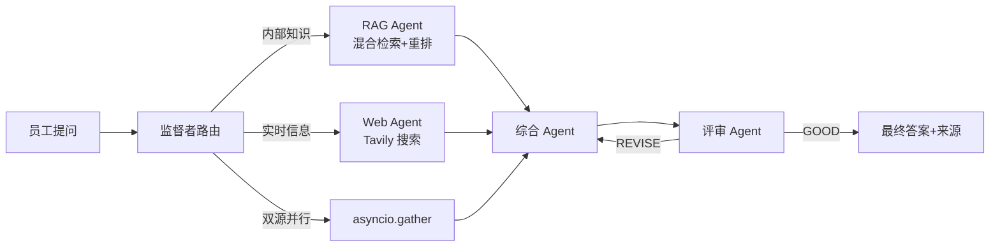

## 1.5 技术挑战清单

| 挑战 | 具体问题 | 不解决的后果 |
|---|---|---|
| 检索精度 | 向量召回不准 | 答案跑题 |
| 召回宽度 | 只靠语义漏掉关键词命中 | 漏掉专有名词 |
| 编排复杂度 | 4 个 Agent 谁先谁后 | 代码乱成一团 |
| 答案质量 | 一次生成可能幻觉 | 不可信 |
| 实时性 | 检索+生成耗时长 | 前端假死 30 秒 |
| 可观测 | 黑盒跑完不知道哪步出问题 | 难以调试 |
| 多轮记忆 | 每轮都从头开始 | 上下文断裂 |
| 工具复用 | 检索能力只能内嵌 | 无法被其他客户端调用 |

## 1.6 技术栈总览

| 层级 | 技术 | 为什么选它 |
|---|---|---|
| LLM/Embedding | 智谱 GLM-4-Flash、embedding-3 | 国内可直连、免费额度、1024 维 |
| 向量库 | Qdrant（dense+sparse 混合） | 同时支持稠密+稀疏向量 |
| 稀疏 | FastEmbed BM25 | 本地、轻量 |
| 重排 | BAAI/bge-reranker-base | 本地免费 cross-encoder |
| 知识图谱（已移除） | ~~Neo4j Aura + jieba~~ | 2026-09 已移除，仅作历史参考 |
| 编排 | LangGraph（异步节点） | 状态机 + 循环 + checkpoint |
| 记忆 | SQLite checkpoint | 零依赖、文件持久化 |
| 可观测 | LangSmith | 全链路 trace |
| 评估 | RAGAS 4 维评估（黄金集 + LLM-judge） | 标准框架，faithfulness/relevancy/precision/recall |
| Web 搜索 | Tavily | 免费 1000 次/月 |
| 后端 | FastAPI + SSE | 异步、流式 |
| 前端 | React 19 + Vite + shadcn/ui | 现代化、组件全 |
| 部署 | Docker + GitHub Actions | 一键 CI/CD |

## 1.7 能力清单（WHAT）

| 序号 | 能力 | 说明 | 优先级 |
|---|---|---|---|
| 1 | 文档导入 | PDF/DOCX/TXT/MD → 分块 → 双向量入库 | P0 |
| 2 | 混合检索 | Dense + Sparse 双路融合 + 重排 | P0 |
| 3 | 多智能体编排 | 监督者路由 + 4 个专家 Agent | P0 |
| 4 | 评估-修订闭环 | 评审反馈回传，迭代修订 | P0 |
| 5 | 流式执行 | SSE 实时推送每一步 | P1 |
| 6 | 对话记忆 | SQLite checkpoint，6 轮窗口 | P1 |
| 7 | 知识图谱可视化（已移除） | 原 vis-network 实时渲染 | — |
| 8 | 量化评估 | 黄金集 + RAGAS 4 维 LLM-judge + 报告存档 | P1 |
| 9 | MCP 工具层 | 4 个工具暴露给外部客户端 | P2 |

---

# 第二章 核心问题推演

## 问题 1：如何让 LLM 基于私有知识回答问题？（RAG 的本质）

### 第一步 WHY：为什么直接问大模型不行？

**业务场景**：员工问 "Q3 收入趋势是什么"。报告是公司内部 PDF，从未对外发布，大模型训练语料里根本不存在。

**生活类比**：让一个没读过你公司报告的实习生凭空回答你的财务问题——他要么说"不知道"，要么编一个看起来很像真的数字（幻觉）。

**痛点量化**：

| 场景 | 直接问 LLM | 后果 |
|---|---|---|
| 问私有文档 | 模型没见过 | 编造或拒答 |
| 问昨天新闻 | 训练截止 6 个月前 | 答的是旧闻 |
| 要引用来源 | 模型张口就来 | 无法审计 |
| 塞全量文档 | 100 份 PDF × 50 页 | Token 超限、慢、贵 |

### 第二步 WHAT：需要什么能力？

| 序号 | 能力 | 说明 | 优先级 |
|---|---|---|---|
| 1 | 文档解析 | PDF/DOCX → 纯文本+表格 | P0 |
| 2 | 分块 | 长文档切成可检索片段 | P0 |
| 3 | 向量化 | 文本 → 1024 维稠密向量 | P0 |
| 4 | 相似度检索 | 问题向量 → 找最相关片段 | P0 |
| 5 | 上下文注入 | 把检索片段拼进 prompt | P0 |
| 6 | 来源标注 | 每条事实标文档+页码 | P1 |

### 第三步 HOW：三种方案对比

| 方案 | 做法 | 优点 | 缺点 | 适用 | 选择 |
|---|---|---|---|---|---|
| 全量塞上下文 | 文档全文拼进 prompt | 实现最简单 | Token 爆炸、贵、慢 | 文档 <8K token | ❌ |
| 关键词检索 + LLM | BM25 找片段 → 拼 prompt | 轻量、快 | 抓不住语义、漏同义词 | 简单场景 | ⚠️ |
| 向量 RAG | 文档分块向量化 → 相似检索 → 拼 prompt | 语义匹配、可控成本 | 需向量库、要调块大小 | 企业级 | ✅ |

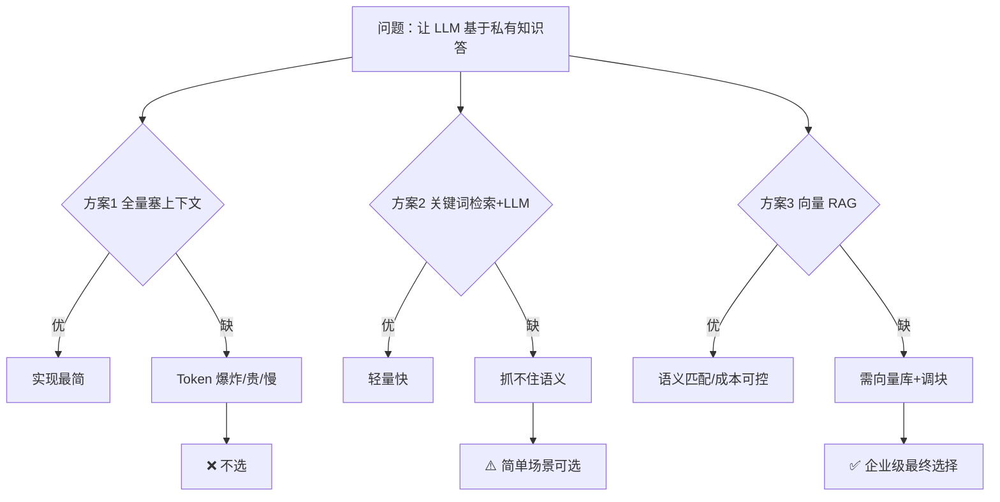

### Trade-off（权衡）

| 维度 | 牺牲 | 收益 | 可接受 |
|---|---|---|---|
| 复杂度 | 要维护向量库、嵌入模型 | 检索精度高、可溯源 | ✅ |
| 成本 | 多一次嵌入调用 | 不必每次塞全量文档 | ✅ |
| 延迟 | 多一次检索往返 | 答案基于真实片段 | ✅ |

**为什么可以接受**：检索往返 < 1 秒，相比"全量塞上下文"每次几十秒+几块钱，ROI 极高。

### 第四步 代码落地

##### ❌ 错误示范：把整个文档塞进 prompt

```python
# 错误做法：文档一大就爆
def answer(query: str) -> str:
    full_doc = open("annual_report.pdf").read()  # 可能 50 万字
    prompt = f"文档：{full_doc}\n问题：{query}"
    return llm.invoke(prompt)  # Token 超限、慢、贵
```

**为什么错**：1）大文档直接超上下文窗口；2）每次都全量传，成本失控；3）无法标注来源。

##### ✅ 正确示范：检索片段再注入

```python
# app/agents/rag_agent.py 核心思路
class RAGAgent:
    def __init__(self, retriever: HybridRetriever):
        self.retriever = retriever

    def run(self, query: str) -> str:
        # 1. 只检索最相关的 top_k 片段（而非全文）
        docs = self.retriever.invoke(query)
        # 2. 片段带 source/page 元数据，便于标注来源
        context = "\n".join(
            f"[Doc {i}] Source: {d.metadata.get('source')} | "
            f"Page: {d.metadata.get('page', '?')}\n{d.page_content}"
            for i, d in enumerate(docs, 1)
        )
        # 3. 把"片段+问题"喂给 LLM，让它基于片段答
        return (RAG_PROMPT | llm).invoke({"query": query, "context": context}).content
```

**为什么对**：1）只传相关片段，Token 可控；2）每段带 source/page，可溯源；3）prompt 明确要求"基于上下文答，不足就说明"，抑制幻觉。

### 时序图

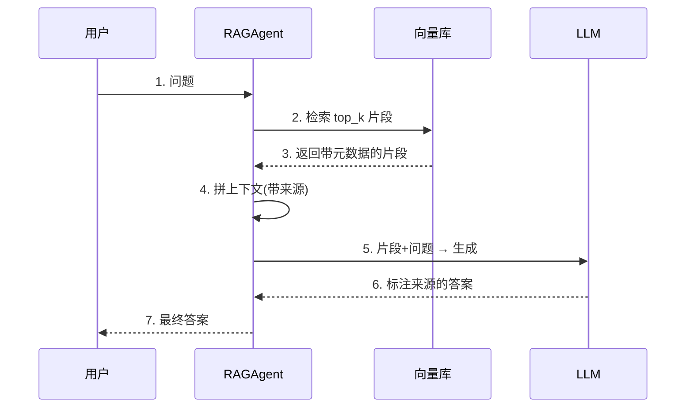

### 面试追问

| 问题 | 回答要点 |
|---|---|
| 为什么不全量塞上下文？ | Token 超限、成本高、慢；检索只传相关片段 |
| 块大小怎么定？ | 400 字符 + 40 重叠，header-aware 按标题切分，平衡召回与精度 |
| 检索不到怎么办？ | prompt 明确"上下文不足就说明"，抑制幻觉 |
| 怎么标注来源？ | 每段 metadata 存 source/page，拼进上下文 |

---

## 问题 2：如何兼顾语义与关键词的混合检索？

### 第一步 WHY：为什么单一向量检索不够？

**业务场景**：员工问 "report.pdf 第 3 页的表格"。纯语义检索会把"report.pdf"当成普通词，抓不到文件名；纯关键词检索又会漏掉"收入趋势"和"营收走向"这种同义表达。

**痛点**：

| 检索方式 | 擅长 | 抓不住 |
|---|---|---|
| 纯 Dense（语义） | 同义词、近义、概念 | 专有名词、文件名、编号 |
| 纯 Sparse（BM25） | 精确关键词、文件名 | 同义、改写、概念 |
| 纯 KG（已移除） | 实体关系多跳 | 全文模糊匹配 |

**生活类比**：语义检索像"听懂意思"，关键词检索像"死抠字眼"，二者互补才能既抓同义又抓专有名词。

### 第二步 WHAT：需要什么能力？

| 序号 | 能力 | 说明 | 优先级 |
|---|---|---|---|
| 1 | Dense 召回 | 智谱 embedding 语义匹配 | P0 |
| 2 | Sparse 召回 | BM25 关键词匹配 | P0 |
| 3 | KG 多跳（已移除） | 原 Neo4j 实体关系检索 | — |
| 4 | 融合排序 | RRF 倒数秩融合 | P0 |
| 5 | 元数据过滤 | LLM 提取 source/page 过滤器 | P1 |
| 6 | 重排 | Cross-Encoder 精排 | P0 |

### 第三步 HOW：双路融合方案对比

| 方案 | 做法 | 优点 | 缺点 | 选择 |
|---|---|---|---|---|
| 单 Dense | 只向量相似 | 实现最简 | 漏专有名词 | ❌ |
| Dense + Sparse | 两路并行 → RRF 融合 | 互补 | 无关系推理 | ⚠️ |
| Dense + Sparse + 重排 | 双路 → RRF → CrossEncoder | 互补 + 精排 | 无关系推理（KG 已移除） | ✅ |

### Trade-off

| 维度 | 牺牲 | 收益 | 可接受 |
|---|---|---|---|
| 延迟 | 多路并发检索 | 召回率↑ | ✅ 并行不增串行延迟 |
| 复杂度 | 维护双数据源（Dense/Sparse） | 精度↑ | ✅ |
| 成本 | 多一次嵌入/查询 | 效果显著 | ✅ |

### 第四步 代码落地

##### ❌ 错误示范：只走单一向量检索

```python
# 错误：抓不住文件名/页码等关键词
def retrieve(query: str):
    return vector_store.similarity_search(query, k=10)  # 纯语义
```

**为什么错**：用户说 "report.pdf" 时，语义检索把它当普通词，召回不到指定文件。

##### ✅ 正确示范：双路混合 + RRF + 重排

```python
# app/rag/retriever.py 核心思路（KG 分支已随 2026-09 重构移除）
class HybridRetriever(BaseRetriever):
    def _get_relevant_documents(self, query, run):
        # 1. LLM 提取元数据过滤器（source/page/content_type）
        filters = self._extract_filters(query)
        # 2. Dense + Sparse 双路召回（Qdrant hybrid 模式，服务端 RRF 融合）
        candidates = self.store.similarity_search(
            query, k=settings.retrieval_top_k, filter=filters
        )
        # 3. Cross-Encoder 重排（仅当候选数 > top_n 时触发）
        if settings.use_reranking and len(candidates) > settings.reranker_top_n:
            candidates = self.reranker.rerank(query, candidates)
        return candidates[: settings.reranker_top_n]
```

**为什么对**：1）Dense 抓语义、Sparse 抓关键词，双路互补；2）RRF 融合避免某路分数偏高压倒其他；3）重排只在候选多时触发，省算力。原 KG 第三路因成本高收益低，已于 2026-09 移除。

### 混合检索内部流程

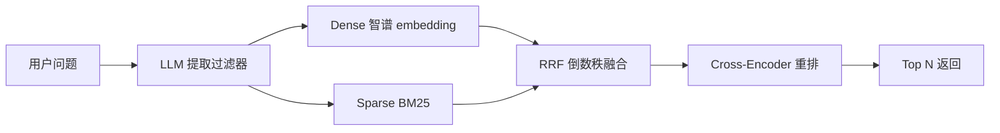

### 附加设计：LLM 过滤器与多查询扩展

| 机制 | 何时触发 | 作用 |
|---|---|---|
| LLM 过滤器 | 始终 | 从"report.pdf 第3页"提取 source=report.pdf, page=3 |
| Multi-Query | USE_MULTI_QUERY=true | LLM 把一个问题改写成 3 个，扩大召回 |

### 面试追问

| 问题 | 回答要点 |
|---|---|
| 为什么不只用向量？ | 漏专有名词、文件名、编号 |
| RRF 是什么？ | 倒数秩融合，1/(60+rank)，避免分数量纲不一 |
| KG 还用吗？ | 已移除（2026-09），原 USE_KG_RETRIEVAL 开关与 kg.py 均已删除 |
| 重排何时触发？ | 候选数 > reranker_top_n 才触发，省算力 |

---

## 问题 3：如何提升检索相关性？（Cross-Encoder 重排序）

### 第一步 WHY：为什么召回后还要重排？

**业务场景**：双路召回回来 20 个片段，其中只有 5 个真正能回答问题。但召回阶段用的是 Bi-Encoder（问题和文档分别编码再算相似度），它快但粗。

**痛点**：

| 阶段 | 模型 | 方式 | 精度 | 速度 |
|---|---|---|---|---|
| 召回 | Bi-Encoder | 问题、文档分别编码 | 粗 | 快（可离线编码文档） |
| 重排 | Cross-Encoder | 问题+文档拼接编码 | 精 | 慢（每对都跑一次） |

**生活类比**：召回像图书馆按书名粗筛 20 本，重排像逐本翻目录精挑 5 本。

### 第二步 WHAT：需要什么能力？

| 序号 | 能力 | 说明 | 优先级 |
|---|---|---|---|
| 1 | 精排模型 | BAAI/bge-reranker-base | P0 |
| 2 | 懒加载 | 避免每次实例化都加载 | P0 |
| 3 | 降级容错 | 模型加载失败时跳过重排 | P0 |
| 4 | 触发条件 | 候选数 > top_n 才重排 | P1 |

### 第三步 HOW：重排方案对比

| 方案 | 做法 | 优点 | 缺点 | 选择 |
|---|---|---|---|---|
| 不重排 | 直接取召回 top_n | 最快 | 精度低 | ❌ |
| LLM 打分 | 让 LLM 给每对打分 | 灵活 | 贵、慢 | ⚠️ |
| Cross-Encoder | bge-reranker 本地打分 | 快、准、免费 | 要下模型 | ✅ |

### Trade-off

| 维度 | 牺牲 | 收益 | 可接受 |
|---|---|---|---|
| 延迟 | 每对多几十毫秒 | 精度显著提升 | ✅ |
| 部署 | 要下 1GB 模型 | 本地、免费 | ✅ HF 镜像兜底 |
| 风险 | 模型加载可能失败 | 降级为不重排 | ✅ |

### 第四步 代码落地

##### ❌ 错误示范：每次都重新加载模型

```python
# 错误：每次 rerank 都加载 1GB 模型，慢到无法用
def rerank(query, docs):
    model = CrossEncoder("BAAI/bge-reranker-base")  # 每次加载！
    return sorted(zip(model.predict(...), docs), reverse=True)
```

**为什么错**：模型加载耗时几秒，每次都加载会让每次查询都卡几秒。

##### ✅ 正确示范：懒加载单例 + 降级容错

```python
# app/rag/reranker.py 核心思路
class CrossEncoderReranker:
    _model = None  # 类级单例，只加载一次

    def _get_model(self):
        if CrossEncoderReranker._model is None:
            try:
                from sentence_transformers import CrossEncoder
                CrossEncoderReranker._model = CrossEncoder(self.model_name)
            except Exception as e:
                # 模型下载失败/加载失败 → 静默降级，不阻断主流程
                logger.warning("重排序器加载失败（%s），跳过重排序。", e)
                CrossEncoderReranker._model = None
        return CrossEncoderReranker._model

    def rerank(self, query, documents):
        model = self._get_model()
        # 模型挂了或没文档 → 直接截断返回，不报错
        if model is None or not documents:
            return documents[: self.top_n]
        pairs = [(query, doc.page_content) for doc in documents]
        scores = model.predict(pairs)
        return [d for _, d in sorted(zip(scores, documents), reverse=True)]
```

**为什么对**：1）类级单例，全进程只加载一次；2）加载失败降级为不重排，不阻断查询；3）空文档直接返回，避免边界报错。

### 真实工程坑：bge 模型下载失败

项目实际踩坑：`sentence-transformers` 默认从 huggingface.co 下模型，国内直连超时。

**解决方案**（已在 `app/api.py` 启动时设置）：

```python
# 国内走 hf-mirror 镜像
if not os.environ.get("HF_ENDPOINT"):
    os.environ["HF_ENDPOINT"] = "https://hf-mirror.com"
```

### 面试追问

| 问题 | 回答要点 |
|---|---|
| 为什么不只用召回？ | Bi-Encoder 粗，Cross-Encoder 精 |
| 为什么用单例？ | 模型加载耗时，全进程一次 |
| 模型下载失败怎么办？ | 降级为不重排，不阻断主流程 |
| 何时触发重排？ | 候选数 > top_n 才触发，省算力 |

---

## 问题 4：如何编排多个专家 Agent？（LangGraph 状态机）

### 第一步 WHY：为什么不能一个 Agent 干所有事？

**业务场景**：检索、网络搜索、综合、评审，四件事逻辑完全不同。塞进一个 Agent 会：prompt 巨长、职责混乱、无法循环、难调试。

**痛点**：

| 单 Agent 做法 | 后果 |
|---|---|
| 一个 prompt 写四件事 | prompt 巨长、模型抓不住重点 |
| 无法循环修订 | 评审反馈回不来 |
| 全程黑盒 | 不知道哪步出错 |
| 职责耦合 | 改一处牵动全身 |

**生活类比**：让一个厨师同时择菜、炒菜、摆盘、试吃——不如流水线分工，每步专精还能回炉。

### 第二步 WHAT：需要什么能力？

| 序号 | 能力 | 说明 | 优先级 |
|---|---|---|---|
| 1 | 路由 | 监督者决定走哪条路 | P0 |
| 2 | 并行 | RAG + Web 同时跑 | P0 |
| 3 | 循环 | 评审 REVISE 回综合 | P0 |
| 4 | 状态 | 各节点共享 AgentState | P0 |
| 5 | 记忆 | checkpoint 持久化对话 | P1 |
| 6 | 可观测 | 每节点自动 trace | P1 |

### 第三步 HOW：编排方案对比

| 方案 | 做法 | 优点 | 缺点 | 选择 |
|---|---|---|---|---|
| 串行 if-else | 硬编码先后顺序 | 简单 | 无法循环、难扩展 | ❌ |
| LangChain Chain | LCEL 链式 | 声明式 | 循环弱 | ⚠️ |
| LangGraph 状态机 | 节点+边+条件路由 | 循环、并行、checkpoint | 学习曲线 | ✅ |

### 监督者路由方案对比

| 路由策略 | 做法 | 缺点 |
|---|---|---|
| 只走 RAG | 永远知识库 | 漏实时信息 |
| 只走 Web | 永远网络 | 漏私有知识 |
| 固定双源 | 永远都跑 | 浪费（简单问题也双跑） |
| LLM 路由 | 监督者按问题决定 | 灵活 ✅ |

### Trade-off

| 维度 | 牺牲 | 收益 | 可接受 |
|---|---|---|---|
| 学习成本 | 要懂 LangGraph | 循环+并行+状态 | ✅ |
| 复杂度 | 多一个框架依赖 | 编排清晰可追踪 | ✅ |
| 调试 | 节点多 | 每节点独立 trace | ✅ LangSmith 补偿 |

### 第四步 代码落地

##### ❌ 错误示范：硬编码串行 if-else

```python
# 错误：无法循环、无法并行、难扩展
def run(query):
    rag = rag_agent.run(query)          # 总是先 RAG
    web = web_agent.run(query)          # 总是再 Web
    answer = synthesize(rag, web)       # 总是综合
    critique = critique_agent.run(answer)
    if "REVISE" in critique:
        # 想回炉？这里没法优雅回到 synthesize
        pass
    return answer
```

**为什么错**：1）串行慢（RAG 和 Web 本可并行）；2）循环只能 hack；3）加一个 Agent 要改主干。

##### ✅ 正确示范：LangGraph 状态机

```python
# app/graph/workflow.py 核心思路
class AgentState(TypedDict):
    messages: Annotated[List[BaseMessage], add_messages]
    query: str
    rag_context: str
    web_context: str
    draft_answer: str
    final_answer: str
    critique: str
    iterations: int
    route: str

builder = StateGraph(AgentState)
builder.add_node("supervisor", supervisor_node)   # 路由
builder.add_node("rag", rag_node)                 # RAG Agent
builder.add_node("web", web_node)                 # Web Agent
builder.add_node("synthesis", synthesis_node)     # 综合
builder.add_node("critique", critique_node)       # 评审

builder.add_conditional_edges("supervisor", route_decision, {
    "rag_agent": "rag", "web_agent": "web", "both": "both_parallel",
})
# 评审后条件回边：GOOD → END，REVISE → synthesis
builder.add_conditional_edges("critique", lambda s: END if "GOOD" in s["critique"] else "synthesis")
```

**为什么对**：1）声明式状态机，路由/并行/循环都清晰；2）`asyncio.gather` 让 RAG+Web 真并行；3）条件回边天然支持评审-修订闭环。

### 双源真并行（asyncio.gather）

```python
# app/graph/workflow.py
async def both_parallel(state):
    # 两路真正并发，谁慢等谁，但总时长≈慢的那路
    rag_ctx, web_ctx = await asyncio.gather(
        rag_agent.run_async(state["query"]),
        web_agent.run_async(state["query"]),
    )
    return {"rag_context": rag_ctx, "web_context": web_ctx}
```

### 整体工作流

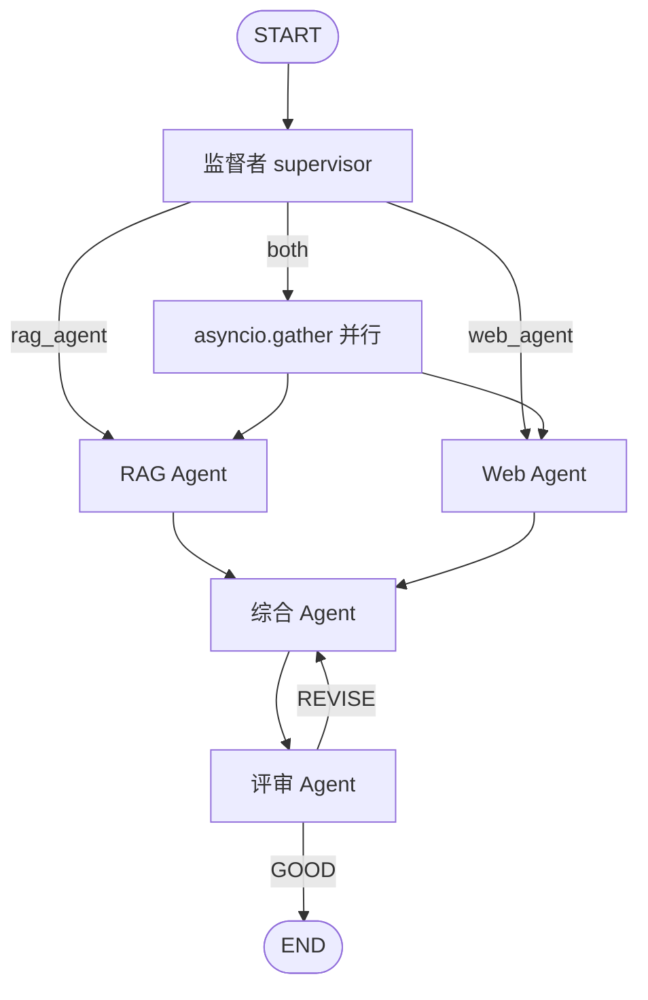

### 状态流转

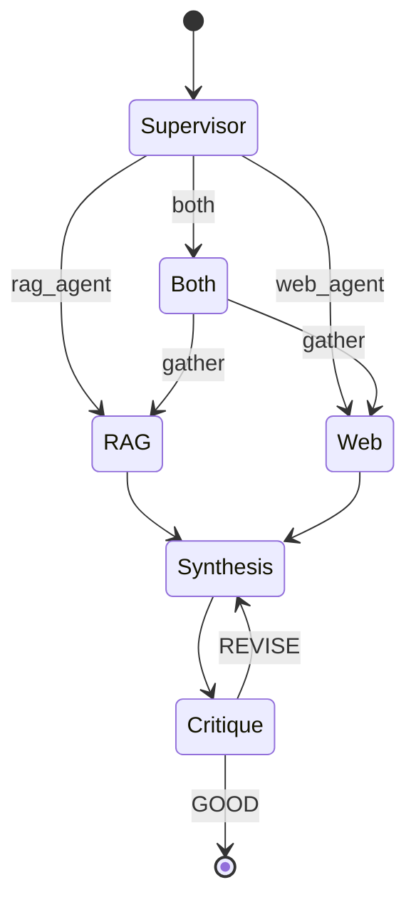

### 面试追问

| 问题 | 回答要点 |
|---|---|
| 为什么用 LangGraph 不用 Chain？ | 需要循环和并行，Chain 循环弱 |
| 双源怎么并行？ | asyncio.gather，总时长≈慢路 |
| 评审怎么回炉？ | conditional_edges 回到 synthesis 节点 |
| 最大迭代几次？ | MAX_ITERATIONS=5，防死循环 |

---

## 问题 5：如何保障答案质量？（评估-修订闭环）

### 第一步 WHY：为什么一次生成不够？

**业务场景**：综合 Agent 一次生成的答案，可能漏引用、可能幻觉、可能不完整。直接返给用户，质量不可控。

**痛点**：

| 一次性生成的问题 | 后果 |
|---|---|
| 可能幻觉 | 误导决策 |
| 可能漏来源 | 无法审计 |
| 可能不完整 | 用户追问 |
| 质量不稳定 | 时好时坏 |

**生活类比**：写作文不校稿就交——评审 Agent 就是"校稿+逐条改"的循环。

### 第二步 WHAT：需要什么能力？

| 序号 | 能力 | 说明 | 优先级 |
|---|---|---|---|
| 1 | 评审维度 | 忠实/完整/准确/清晰 | P0 |
| 2 | 反馈结构 | GOOD 或 REVISE: 指令 | P0 |
| 3 | 回炉修订 | 反馈回传综合 Agent | P0 |
| 4 | 上限保护 | 最大迭代次数 | P0 |
| 5 | 全程追踪 | LangSmith trace | P1 |

### 第三步 HOW：质量保障方案对比

| 方案 | 做法 | 优点 | 缺点 | 选择 |
|---|---|---|---|---|
| 不评审 | 一次生成即终稿 | 快 | 质量不稳 | ❌ |
| 人工抽检 | 人看一眼 | 准 | 不可扩展 | ⚠️ |
| 自我批评闭环 | 评审 Agent 反馈→回炉→再审 | 自动、可迭代 | 多耗 LLM | ✅ |

### 追踪方案对比

| 方案 | 做法 | 缺点 |
|---|---|---|
| print 日志 | 控制台打 | 难聚合、难关联 |
| 自建 trace | 自己埋点 | 工作量大 |
| LangSmith | 框架自动 trace | 依赖外部 |

### Trade-off

| 维度 | 牺牲 | 收益 | 可接受 |
|---|---|---|---|
| 延迟 | 多几轮 LLM 调用 | 质量显著提升 | ✅ 用户可等 |
| 成本 | 多耗 token | 答案可信 | ✅ |
| 复杂度 | 多一个 Agent | 自动迭代 | ✅ |

### 第四步 代码落地

##### ❌ 错误示范：一次性生成即终稿

```python
# 错误：无评审、无回炉，质量全靠运气
def answer(query):
    ctx = retrieve(query)
    return llm.invoke(f"{ctx}\n{query}").content  # 直接返，不校验
```

**为什么错**：1）可能幻觉；2）可能漏来源；3）质量不可控。

##### ✅ 正确示范：评审反馈回传闭环

```python
# app/graph/workflow.py critique_node + synthesis 闭环
def critique_node(state):
    answer = state["draft_answer"]
    context = state["rag_context"] + "\n" + state["web_context"]
    critique = (CRITIQUE_PROMPT | llm).invoke({
        "query": state["query"], "context": context, "answer": answer
    }).content
    # 评审返回 GOOD 或 REVISE: 改进指令
    if "GOOD" in critique:
        return {"final_answer": answer, "critique": critique}
    # REVISE：把反馈写回 state，综合节点下一轮会逐条解决
    return {"critique": critique, "iterations": state["iterations"] + 1}

def synthesis_node(state):
    # 综合 prompt 明确：收到 REVISE 必须逐条解决；收到 GOOD 保持质量
    return {"draft_answer": (SYNTHESIS_PROMPT | llm).invoke({
        "query": state["query"],
        "rag_context": state["rag_context"],
        "web_context": state["web_context"],
        "previous_answer": state.get("draft_answer", ""),
        "critique": state.get("critique", ""),
        "history": format_history(state["messages"]),
    }).content}
```

**为什么对**：1）评审返回结构化 GOOD/REVISE；2）REVISE 反馈回传综合节点逐条改；3）MAX_ITERATIONS 防死循环。

### 评审 prompt 关键设计

```text
评分规则：
- 所有标准通过 → 精确回复：GOOD
- 任何标准未通过 → REVISE: [具体改进指令，逐条列出]
"GOOD" 意味着你愿意为这个答案的准确性担保。
```

### 评估循环时序

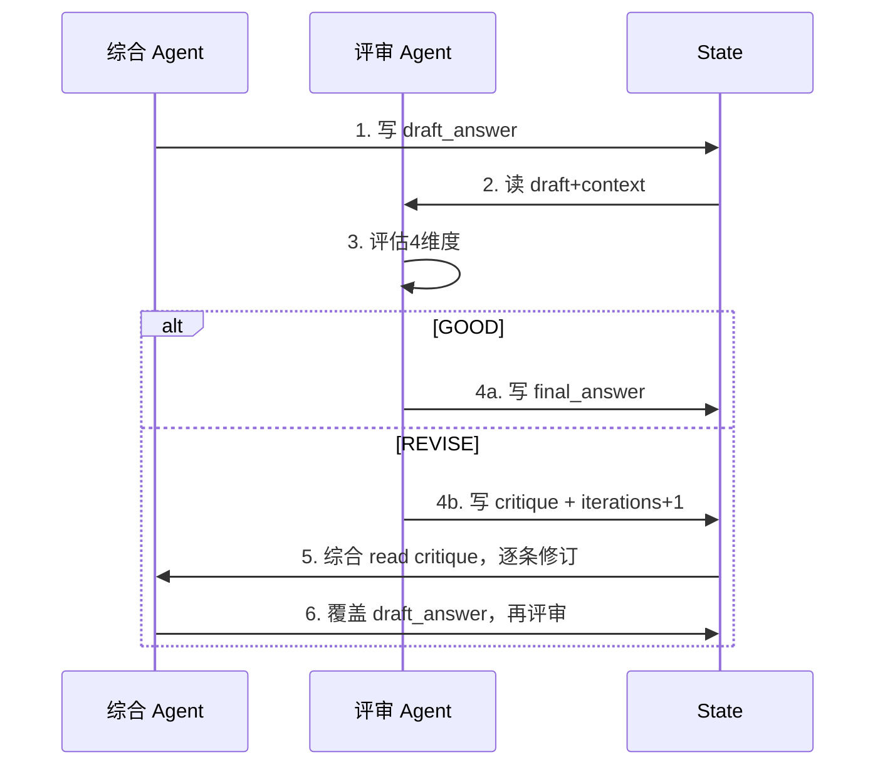

### 面试追问

| 问题 | 回答要点 |
|---|---|
| 为什么不一次生成？ | 质量不稳，可能幻觉/漏来源 |
| 评审怎么回炉？ | conditional_edges 回 synthesis 节点 |
| 死循环怎么办？ | MAX_ITERATIONS=5 上限保护 |
| 怎么追踪？ | LangSmith 自动 trace 每轮 |

---

## 问题 6：如何做知识图谱多跳检索？（Neo4j）【已移除，仅作历史参考】

> **该功能已在 2026-09 重构中移除**：原 kg_retrieve 只是 jieba 关键词 + 一跳邻居，并非真正的图推理，成本高收益低，已删除；`neo4j`/`jieba` 依赖、`NEO4J_*` 配置、`app/rag/kg.py` 均已移除。以下内容仅作历史教学参考。

### 第一步 WHY：为什么向量检索之外还要知识图谱？

**业务场景**：员工问 "GPT-4 用的什么技术，那个技术还用在哪些产品里"。这是两跳关系：GPT-4 → 技术 → 其他产品。向量检索只能抓"相似片段"，抓不住跨文档的实体关系链。

**痛点**：

| 检索 | 擅长 | 抓不住 |
|---|---|---|
| 向量 | 模糊语义 | 实体关系多跳 |
| BM25 | 关键词 | 跨文档推理 |
| KG | 实体关系多跳 | 全文模糊 |

**生活类比**：向量检索像"翻相似书页"，KG 像"顺藤摸瓜找关系"。

### 第二步 WHAT：需要什么能力？

| 序号 | 能力 | 说明 | 优先级 |
|---|---|---|---|
| 1 | 实体抽取 | LLM 结构化抽实体+关系 | P0 |
| 2 | 图存储 | Neo4j 存节点+边 | P0 |
| 3 | 增量写入 | UNWIND MERGE 不重复 | P0 |
| 4 | 多跳检索 | jieba 分词 + Cypher | P0 |
| 5 | 可视化 | vis-network 实时渲染 | P1 |

### 第三步 HOW：三种方案对比

| 方案 | 做法 | 优点 | 缺点 | 选择 |
|---|---|---|---|---|
| LLM 自己拼关系 | 让 LLM 从文档现推 | 零存储 | 慢、易错、不可复现 | ❌ |
| 内存图 | 字典存关系 | 轻量 | 不可持久、不并发 | ⚠️ |
| Neo4j 图库 | Cypher 多跳查询 | 持久、专业、可视化 | 要部署 | ✅ |

### Trade-off

| 维度 | 牺牲 | 收益 | 可接受 |
|---|---|---|---|
| 部署 | 要 Neo4j Aura | 专业图查询 | ✅ 免费层够用 |
| 成本 | 多一次 LLM 抽取 | 实体可复用 | ✅ |
| 复杂度 | 学 Cypher | 多跳能力 | ✅ |

### 第四步 代码落地

##### ❌ 错误示范：LLM 现推关系

```python
# 错误：每次查询都让 LLM 从 docs 里推关系，慢且不可复现
def kg_retrieve(query, docs):
    return llm.invoke(f"从这些片段推出关系：{docs}\n问题：{query}")
```

**为什么错**：1）每次都重新推，慢；2）LLM 推关系易错；3）无法跨查询复用。

##### ✅ 正确示范：Neo4j 增量图库

```python
# app/rag/kg.py 核心思路
class ExtractionResult(BaseModel):
    entities: List[Entity]
    relations: List[Relation]

# 1. LLM 结构化抽取（Pydantic 约束输出）
def extract(text):
    return (EXTRACT_PROMPT | llm.with_structured_output(ExtractionResult)).invoke({"text": text})

# 2. UNWIND 批量 MERGE，增量去重
def upsert(entities, relations):
    aura_query("""
    UNWIND $entities AS e
    MERGE (n:Entity {name: e.name})
    SET n.type = e.type, n.description = e.description
    """, {"entities": [e.model_dump() for e in entities]})

# 3. jieba 中文分词 + Cypher 多跳
def kg_retrieve(query, top_k=5):
    keywords = jieba.cut_for_search(query)
    return aura_query("""
    UNWIND $keywords AS kw
    MATCH (n:Entity) WHERE n.name CONTAINS kw
    MATCH (n)-[r:REL*1..2]-(m:Entity)
    RETURN n, r, m LIMIT $limit
    """, {"keywords": list(keywords), "limit": top_k})
```

**为什么对**：1）结构化抽取保证实体规范；2）MERGE 增量去重；3）多跳 Cypher 真正关系推理。

### 真实工程坑：Neo4j Bolt 端口被 RST（已在项目踩坑）

项目实际踩坑：国内网络直连 Neo4j Aura 的 Bolt 7687 端口，常被运营商/代理链路 RST，TLS 握手失败。

**最终解决方案**（已落地）：

| 尝试 | 方案 | 结果 |
|---|---|---|
| 直连 Bolt 7687 | neo4j+s:// | ❌ RST |
| 跳过证书 | neo4j+ssc:// | ⚠️ 静态 HTML 可用，实时不行 |
| HTTP Query API | 443 端口走代理 | ✅ 稳定 |

代码层面：`kg.py` 用 `aura_query()` 走 443 HTTP API，绕开 7687。

### 图检索内部流程


### 图谱数据模型

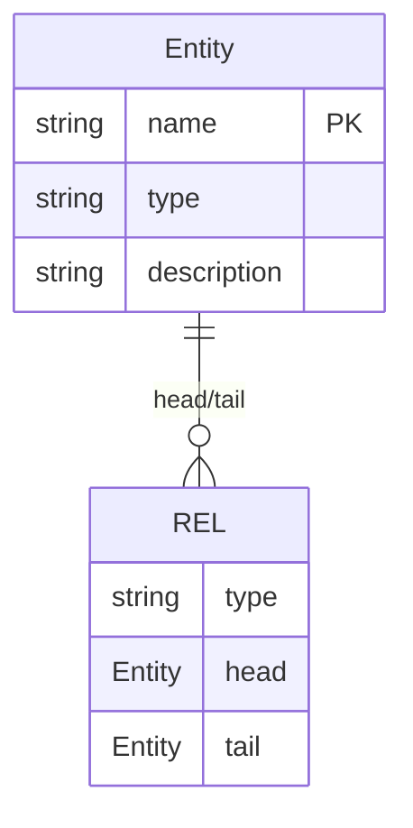

### 面试追问

| 问题 | 回答要点 |
|---|---|
| 为什么不只用向量？ | 抓不住跨文档实体关系多跳 |
| 怎么去重？ | UNWIND + MERGE，按 name 唯一 |
| 中文怎么分词？ | jieba.cut_for_search |
| Bolt 连不上怎么办？ | 走 443 HTTP Query API 绕开 7687 |

---

## 问题 7：如何做 RAGAS 量化评估？

> **当前方案（2026-09-08 换回）**：人工黄金集 `data/golden_set.json` + RAGAS 4 维评估
> （faithfulness / answer_relevancy / context_precision / context_recall），
> 命令 `python -m app.rag.evaluation`，报告存 `data/eval_reports/eval_<时间戳>.json`。
> 历史：2026-09 初曾因旧版 pyarrow 的 `MonthDayNano` pickle bug / NaN 弃用 RAGAS
> 改为轻量评估（recall@k + LLM-as-judge）；升级 pyarrow ≥17 后 bug 消除，换回 RAGAS。

### 第一步 WHY：为什么凭感觉打分不行？

**业务场景**：你改了块大小从 1000→500，检索效果变好还是变坏？凭"看起来不错"无法复现、无法对比、无法回归。

**痛点**：

| 评估方式 | 问题 |
|---|---|
| 肉眼看 trace | 主观、不可量化 |
| 人工抽检 | 不可扩展 |
| 无评估 | 改了不知好坏 |

**生活类比**：考试不批改只"感觉答得不错"——没法知道真实水平。

### 第二步 WHAT：需要什么能力？

| 序号 | 能力 | 说明 | 优先级 |
|---|---|---|---|
| 1 | 自动生成评测集 | 从文档生成 (query, ground_truth) | P0 |
| 2 | 四指标 | Faithfulness/Relevancy/Precision/Recall | P0 |
| 3 | 报告存档 | 可对比、可回归 | P1 |
| 4 | 单线程执行 | 避免 RAGAS 内部卡死 | P0 |

### 第三步 HOW：三种评估方案对比

| 方案 | 做法 | 优点 | 缺点 | 选择 |
|---|---|---|---|---|
| LangSmith 肉眼看 | 平台看 trace | 零代码 | 主观、不可量化 | ❌ |
| 人工标数据集 | 人标 ground truth | 准 | 不可扩展 | ⚠️ |
| RAGAS 自动评估 | 框架跑 4 指标 | 客观、可复现 | 慢、要调 | ✅ |

### Trade-off

| 维度 | 牺牲 | 收益 | 可接受 |
|---|---|---|---|
| 时间 | 跑一次 3-10 分钟 | 客观可对比 | ✅ 异步不阻塞 |
| 成本 | 多耗 LLM token | 可量化 | ✅ |
| 复杂度 | 学 RAGAS API | 可回归 | ✅ |

### 第四步 代码落地

##### ❌ 错误示范：在 LangSmith 肉眼打分

```python
# 错误：主观、不可量化、不可回归
# 改了块大小，靠"看一眼 trace"判断效果
```

**为什么错**：1）主观；2）不可复现；3）无法对比改动效果。

##### ✅ 正确示范：RAGAS 四指标自动评估

```python
# app/rag/evaluation.py 核心思路
def generate_eval_dataset(n):
    # 1. LLM 从已导入文档生成 N 条 (query, ground_truth) 对
    return (GEN_PROMPT | llm).invoke({"n": n, "docs": sampled_chunks})

def run_ragas_evaluation(sample_count):
    samples = generate_eval_dataset(sample_count)
    results = []
    for s in samples:
        # 2. 每条 query 跑一次 run_query 拿 (answer, context)
        r = run_query(s.query)
        results.append({
            "query": s.query, "ground_truth": s.ground_truth,
            "answer": r["final_answer"], "contexts": [r["rag_context"]],
        })
    # 3. 喂给 RAGAS 跑 4 指标
    metrics = ragas.evaluate(results, metrics=[...])
    # 4. 报告存档，可对比
    save_report(metrics, samples)
    return metrics
```

**为什么对**：1）自动生成评测集，无需人工标；2）4 个客观指标；3）报告存档可回归。

### 真实工程坑：RAGAS 评测卡死（已在项目踩坑）

项目实际踩坑：RAGAS 内部用多线程，在某些环境会卡死不动。

**解决方案**（已落地）：单线程执行，避免 RAGAS 内部线程卡死。

### 评估流程时序

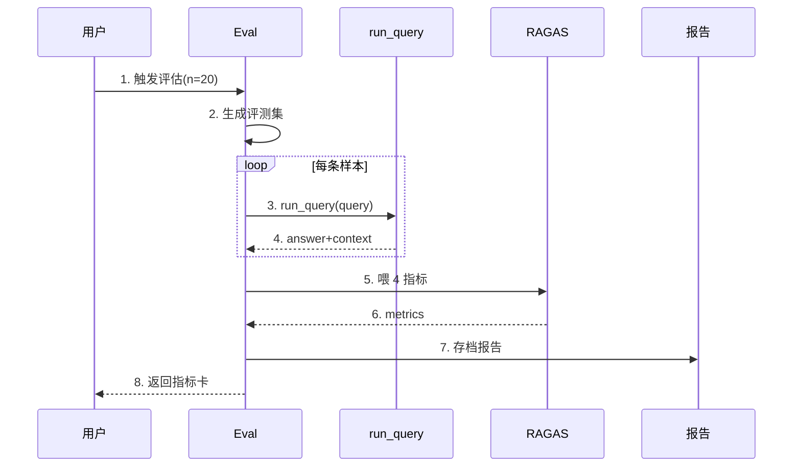

### 面试追问

| 问题 | 回答要点 |
|---|---|
| 为什么不肉眼看 trace？ | 主观、不可量化、不可回归 |
| 四指标是什么？ | Faithfulness/Relevancy/Precision/Recall |
| 评测集怎么来？ | LLM 从文档自动生成 (query, ground_truth) |
| 为什么单线程？ | RAGAS 多线程在某些环境卡死 |

---

## 问题 8：如何做 SSE 流式执行？（前端实时反馈）

### 第一步 WHY：为什么不能一次返？

**业务场景**：监督者路由 → 检索 → 综合 → 评审，全跑完可能 10-30 秒。前端干等会以为卡死，疯狂刷新。

**痛点**：

| 模式 | 后果 |
|---|---|
| 同步等 30 秒 | 前端假死、用户以为崩了 |
| 无进度 | 不知道跑哪步 |
| 无中间态 | 评审 REVISE 时看不到 |

**生活类比**：等外卖不显示进度，你会以为没下单成功。

### 第二步 WHAT：需要什么能力？

| 序号 | 能力 | 说明 | 优先级 |
|---|---|---|---|
| 1 | 流式协议 | SSE（Server-Sent Events） | P0 |
| 2 | 事件分类 | status/critique/final/error | P0 |
| 3 | 前端订阅 | EventSource 逐事件渲染 | P0 |
| 4 | 长超时 | 评估等长任务 600s | P1 |

### 第三步 HOW：流式方案对比

| 方案 | 做法 | 优点 | 缺点 | 选择 |
|---|---|---|---|---|
| 轮询 | 前端定时 GET | 简单 | 浪费、不实时 | ❌ |
| WebSocket | 双向长连 | 实时双向 | 重、要维护心跳 | ⚠️ |
| SSE | 单向流 | 轻、HTTP 友好、自动重连 | 单向 | ✅ |

### Trade-off

| 维度 | 牺牲 | 收益 | 可接受 |
|---|---|---|---|
| 方向 | 单向（服务→前端） | 简单轻量 | ✅ 只需推送 |
| 兼容 | 老浏览器要 polyfill | 现代浏览器原生 | ✅ |

### 第四步 代码落地

##### ❌ 错误示范：同步阻塞等完才返

```python
# 错误：前端干等 30 秒，假死
@app.post("/api/query")
def query(req):
    return run_query(req.query)  # 等全跑完才返
```

**为什么错**：1）前端假死；2）无进度；3）REVISE 看不到中间态。

##### ✅ 正确示范：SSE 流式推送

```python
# app/api.py + app/graph/workflow.py stream_query
@app.post("/api/query/stream")
async def query_stream(req):
    async def event_gen():
        try:
            async for event in stream_query(req.query, thread_id):
                # 逐事件推送：route→rag→web→synthesis→critique→final
                yield f"data: {json.dumps(event, ensure_ascii=False)}\n\n"
        except Exception as e:
            yield f"data: {json.dumps({'type': 'error', 'detail': str(e)})}\n\n"
        finally:
            yield "data: [DONE]\n\n"
    return StreamingResponse(event_gen(), media_type="text/event-stream",
        headers={"Cache-Control": "no-cache", "Connection": "keep-alive",
                 "X-Accel-Buffering": "no"})  # 关键：禁 Nginx 缓冲
```

**为什么对**：1）SSE 逐事件推送；2）X-Accel-Buffering:no 禁 Nginx 缓冲（否则实时性没了）；3）[DONE] 标记结束。

### SSE 事件类型

| type | 何时发 | 内容 |
|---|---|---|
| start | 开始 | thread_id |
| status | 每步 | step=route/rag/web/both/synthesis |
| critique | 评审后 | passed=bool, detail |
| final | 完成 | result=QueryResult |
| error | 异常 | detail |

### 前端订阅

```typescript
// frontend/src/lib/api.ts streamQuery
const es = new EventSource(`/api/query/stream?...`)
es.onmessage = (e) => {
  const ev = JSON.parse(e.data)
  // 按 type 渲染：status→步骤高亮，critique→评审卡，final→答案
}
```

### 流式时序

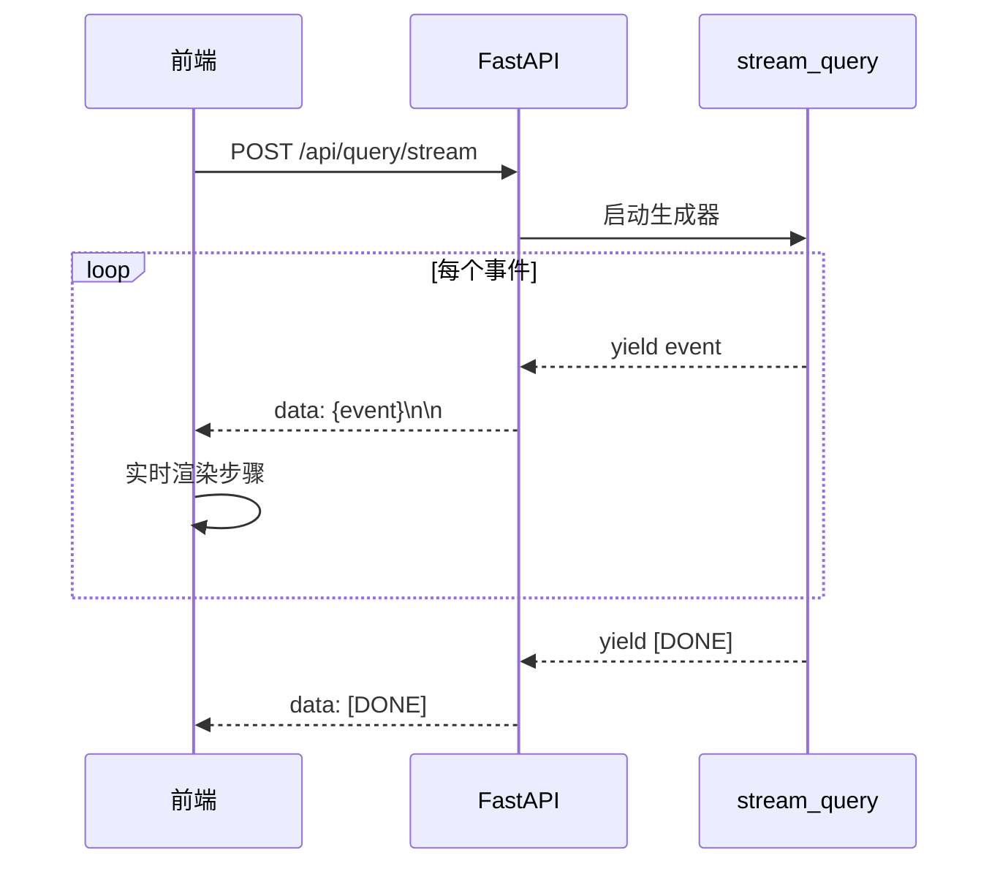

### 面试追问

| 问题 | 回答要点 |
|---|---|
| 为什么不用 WebSocket？ | 只需单向推送，SSE 更轻 |
| Nginx 缓冲怎么办？ | X-Accel-Buffering:no 禁掉 |
| 评估长任务超时？ | Vite proxy timeout 600000ms |
| 前端怎么订阅？ | EventSource 监听 onmessage |

---

## 问题 9：为什么要引入 MCP 工具层？

### 第一步 WHY：为什么检索能力只能内嵌不够？

**业务场景**：你的混合检索、网络搜索、实体抽取很强大，但只能在这个项目里用。Claude Desktop、其他 MCP 客户端想复用，得各自重写。

**痛点**：

| 做法 | 后果 |
|---|---|
| 能力内嵌 | 无法被其他客户端复用 |
| 各客户端重写 | 重复造轮子 |
| 接口不统一 | 每个客户端对接成本高 |

**生活类比**：你家厨艺很好，但只在自己家做——不如开个餐馆让所有人都能点。

### 第二步 WHAT：需要什么能力？

| 序号 | 能力 | 说明 | 优先级 |
|---|---|---|---|
| 1 | 标准协议 | MCP（Model Context Protocol） | P0 |
| 2 | 工具暴露 | rag_search/web_search/full_query/evaluate | P0 |
| 3 | 独立运行 | python -m app.mcp.server | P1 |
| 4 | 跨平台 | Windows DLL 引导 | P1 |

### 第三步 HOW：复用方案对比

| 方案 | 做法 | 优点 | 缺点 | 选择 |
|---|---|---|---|---|
| 内嵌 | 能力留在主项目 | 简单 | 不可复用 | ❌ |
| 自建 REST | 自己写工具接口 | 灵活 | 协议不统一 | ⚠️ |
| MCP 标准 | 走 MCP 协议 | 标准化、可被任意客户端调 | 要学协议 | ✅ |

### Trade-off

| 维度 | 牺牲 | 收益 | 可接受 |
|---|---|---|---|
| 学习 | 学 MCP 协议 | 标准化复用 | ✅ |
| 部署 | 多一个进程 | 独立解耦 | ✅ |

### 第四步 代码落地

##### ✅ 正确示范：MCP Server 暴露 4 个工具

> 工具选择原则：只暴露宿主 LLM 自己做不到的外部能力。
> summarise/extract_entities/calculate 本质是"提示词包一层"，宿主直接调 LLM 更快，已移除。
> parallel_search/direct_answer 是 workflow 内部路由工具，不对外暴露。

```python
# app/mcp/server.py 核心思路（schema 统一在 app/tools/registry.py）
app = Server("omnirag-mcp")

@app.list_tools()
async def list_tools() -> list[Tool]:
    return [
        Tool(name="rag_search", description="搜索内部知识库（已上传文档）", inputSchema={...}),
        Tool(name="web_search", description="Tavily 实时网络搜索", inputSchema={...}),
        Tool(name="full_query", description="跑完整多 Agent 工作流", inputSchema={...}),
        Tool(name="evaluate", description="黄金集评估", inputSchema={...}),
    ]

@app.call_tool()
async def call_tool(name, arguments) -> list[TextContent]:
    if name == "rag_search":
        docs = retriever.invoke(arguments["query"])
        return [TextContent(type="text", text=format_docs(docs))]
    # ... 其他工具分发
```

### 工具清单

| 工具 | 作用 | 复用场景 |
|---|---|---|
| rag_search | 混合检索知识库（复用 create_retriever） | 宿主查私有文档 |
| web_search | Tavily 实时搜索（复用 tavily_search_robust） | 任意客户端查实时信息 |
| full_query | 完整多 Agent 工作流（监督者→检索→综合→评审） | 需要高质量结构化答案 |
| evaluate | 黄金集 + RAGAS 4 维评估 | 离线量化评估 |

### Windows DLL 引导坑（已在项目踩坑）

项目实际踩坑：Windows 上 `mcp` 的 stdio 模块 import `pywintypes`，但 `pywin32_system32` DLL 目录默认不在 `sys.path`。

**解决方案**（已在 `app/__init__.py` + `app/mcp/server.py` 落地）：

```python
# app/__init__.py 启动时引导 DLL 路径
def _bootstrap_windows_dlls():
    if sys.platform != "win32":
        return
    for entry in list(sys.path):
        dll_dir = os.path.join(entry, "pywin32_system32")
        if os.path.isdir(dll_dir):
            os.add_dll_directory(dll_dir)
            # 还要加 win32/lib 子目录才能 import pywintypes
            for sub in ("win32", os.path.join("win32", "lib")):
                sub_path = os.path.join(entry, sub)
                if os.path.isdir(sub_path) and sub_path not in sys.path:
                    sys.path.insert(0, sub_path)
            break
```

### 面试追问

| 问题 | 回答要点 |
|---|---|
| 为什么引入 MCP？ | 工具标准化，可被任意客户端复用 |
| 暴露哪些工具？ | rag_search/web_search/full_query/evaluate（只暴露宿主做不到的） |
| Windows 坑在哪？ | pywin32 DLL 不在 sys.path，要引导 |
| 怎么独立运行？ | python -m app.mcp.server |

---

# 第三章 方案设计总结

## 3.1 核心决策对照表

| 问题 | 最终方案 | 为什么不用其他方案 | Trade-off |
|---|---|---|---|
| LLM 答私有知识 | 向量 RAG | ❌ 全量塞上下文：Token 爆炸 | 多一次检索往返，换可溯源 |
| 混合检索 | Dense+Sparse+RRF+重排 | ❌ 单 Dense：漏专有名词 | 双数据源维护，换精度 |
| 重排序 | Cross-Encoder 单例+降级 | ❌ LLM 打分：贵慢 | 多加载一次模型，换精排 |
| 多 Agent 编排 | LangGraph 状态机 | ❌ Chain：循环弱 | 学一个框架，换循环并行 |
| 答案质量 | 评审-修订闭环 | ❌ 一次生成：质量靠运气 | 多几轮 LLM，换可信 |
| 知识图谱（已移除） | ~~Neo4j Aura + 443 HTTP API~~ | 非真正图推理、成本高收益低，2026-09 已移除 | — |
| 量化评估 | RAGAS 4 维评估（黄金集+LLM-judge） | ❌ 肉眼看 trace：主观 | 标准框架，faithfulness/relevancy/precision/recall |
| 实时反馈 | SSE 流式 | ❌ 轮询：浪费；❌ WebSocket：重 | 单向推送，换简单 |
| 工具复用 | MCP 标准协议 | ❌ 内嵌：不可复用；❌ 自建 REST：不统一 | 学协议，换标准化 |
| 对话记忆 | SQLite checkpoint | ❌ 内存：重启丢；❌ Redis：要部署 | 文件持久，换零依赖 |
| LLM 选型 | 智谱 GLM-4-Flash | ❌ OpenAI：国内访问难 | 国内可直连、免费额度 |
| 文档解析 | Docling→PyMuPDF→zipfile 兜底 | ❌ 只用 Docling：镜像 403 | 三级兜底，换可用性 |

## 3.2 整体架构图

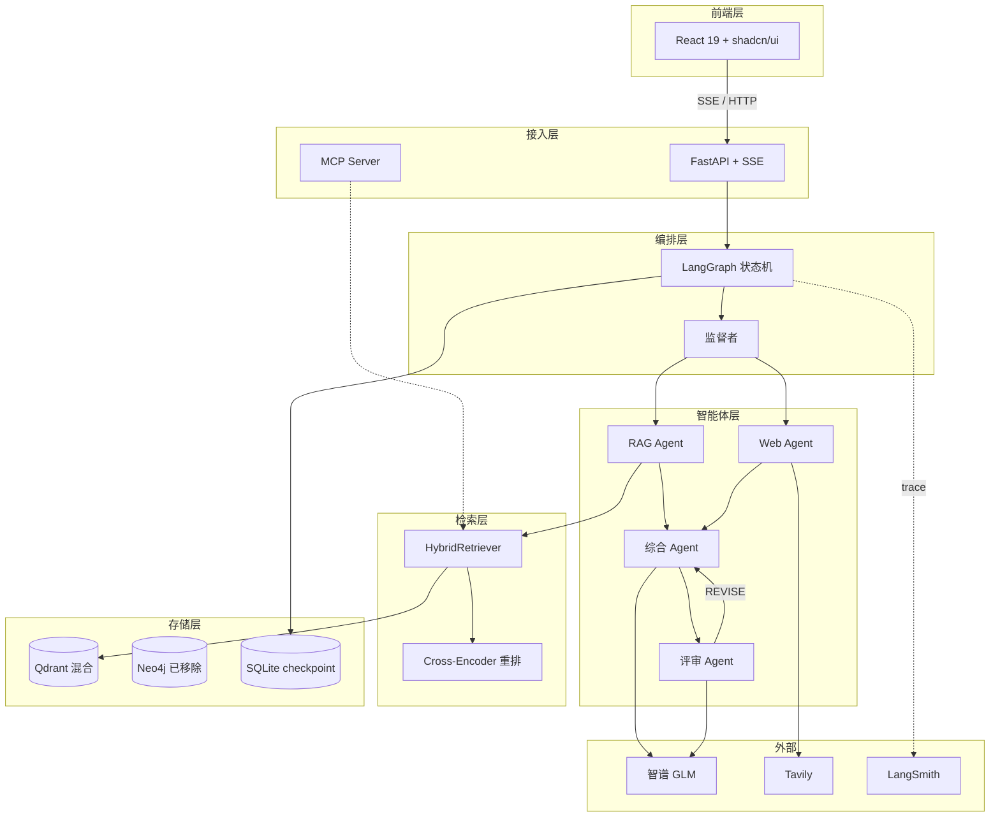

## 3.3 数据流转时序（文档导入链路）

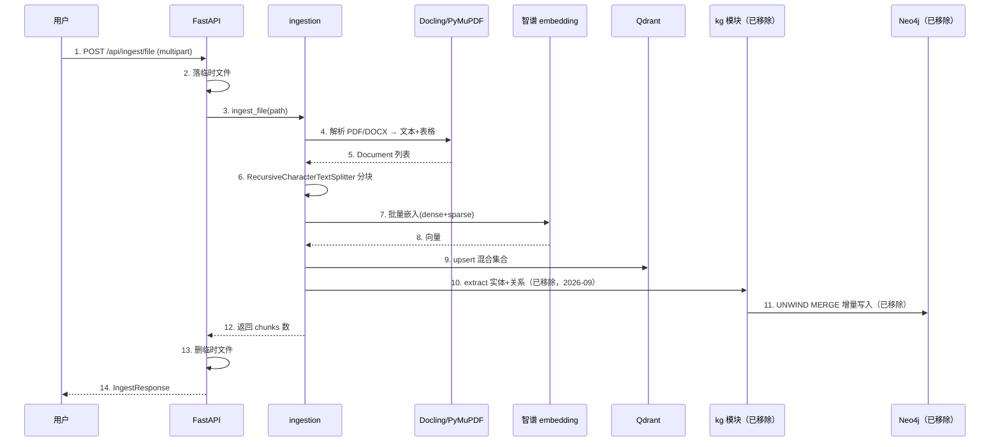

## 3.4 数据模型

### Qdrant collection（混合向量）

| 字段 | 类型 | 说明 |
|---|---|---|
| id | uuid | 点 ID |
| vector (dense) | float[1024] | 智谱 dense 嵌入 |
| sparse_vector | SparseVector | FastEmbed BM25 |
| payload.content | str | 分块文本 |
| payload.metadata.source | str | 来源文件名 |
| payload.metadata.page | int | 页码 |
| payload.metadata.content_type | str | text/table |
| payload.metadata.chunk_hash | str | MD5 去重键 |

### Neo4j 图模型（已移除，2026-09，仅作历史参考）


### SQLite checkpoint（LangGraph）

| 字段 | 说明 |
|---|---|
| thread_id | 会话 ID |
| checkpoint_id | 检查点 ID |
| state | 序列化 AgentState（含 messages） |

## 3.5 MCP 工具层设计

> 原则：只暴露宿主 LLM 自己做不到的外部能力（知识库检索/实时搜索/完整工作流/评估），
> 纯"提示词包一层"的能力（summarise/extract/calculate）已移除。

| 工具 | 输入 | 输出 | 复用方 |
|---|---|---|---|
| rag_search | query, top_k | 检索文档+来源 | 宿主查私有知识库 |
| web_search | query, max_results | Tavily 结果 | 任意 MCP 客户端 |
| full_query | query, thread_id | 完整工作流答案 | 需要高质量结构化答案 |
| evaluate | k, threshold | 评估指标+报告 | 离线量化评估 |

---

# 第四章 完整链路串联

## 4.1 完整时序图（一次完整查询）

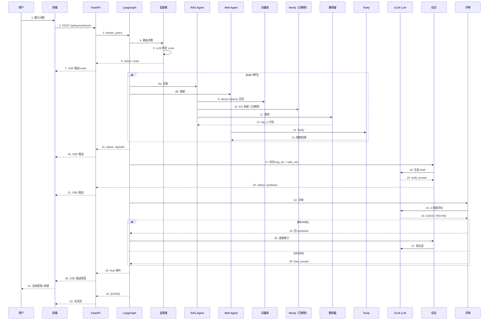

## 4.2 状态流转图

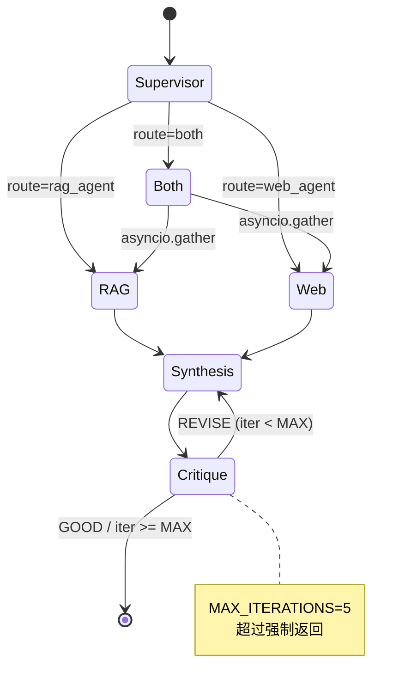

## 4.3 异常场景与兜底

| 异常场景 | 触发点 | 兜底策略 | 已落地 |
|---|---|---|---|
| 检索不到文档 | RAG Agent | 返回"未找到"提示，不报错 | ✅ |
| Tavily 失败 | Web Agent | 返回"网络搜索失败"，不阻断 | ✅ |
| 重排器加载失败 | reranker | 降级为不重排 | ✅ |
| LLM 结构化输出 None | kg 抽取（已移除） | 原重试 + fallback | ✅ |
| Neo4j Bolt RST（已移除） | kg 模块 | 原改走 443 HTTP API | ✅ |
| bge 模型下载超时 | reranker | HF_ENDPOINT=hf-mirror | ✅ |
| RAGAS 评测卡死 | evaluation | 单线程执行（RunConfig.max_workers=1），避免线程卡死 | ✅ |
| 文档解析依赖 403 | ingestion | Docling→PyMuPDF→zipfile 三级兜底 | ✅ |
| 前端拿缺字段 200 | /api/stats | 返回完整结构+error 字段 | ✅ |
| Qdrant SSL 偶断 | /api/stats | 返回 error，前端可选链 | ✅ |
| Windows pywin32 DLL | app/__init__ | 启动引导 DLL 路径 | ✅ |
| 评估长任务超时 | Vite proxy | timeout 600000ms | ✅ |

## 4.4 优化点清单

| 优化点 | 做法 | 收益 |
|---|---|---|
| 双源真并行 | asyncio.gather | 总时长≈慢路，非串行 |
| 重排懒加载单例 | 类级 _model | 全进程只加载一次 |
| 重排条件触发 | 候选 > top_n 才重排 | 候选少时省算力 |
| 向量离线嵌入 | 文档入库时嵌入 | 查询时只嵌问题 |
| SSE 禁缓冲 | X-Accel-Buffering:no | 实时性不丢 |
| HF 国内镜像 | hf-mirror.com | 模型下载不超时 |
| checkpoint 复用 | 同 thread_id 读历史 | 不必重传上下文 |

---

# 第五章 测试验证

## 5.1 功能测试用例

| 用例 | 输入 | 预期 | 验证方式 |
|---|---|---|---|
| 健康检查 | GET /api/health | 200, status=ok | curl |
| 配置查询 | GET /api/config | 返回非敏感配置 | curl |
| 知识库统计 | GET /api/stats | points/sources/content_types | curl |
| 图谱拉取（已移除） | ~~GET /api/graph~~ | 端点已删除 | — |
| 单源查询 | "总结报告" | route=rag_agent | SSE 事件 |
| 网络查询 | "今天 AI 新闻" | route=web_agent | SSE 事件 |
| 双源并行 | "对比内部和外部" | route=both | SSE 事件 |
| 文件导入 | POST /api/ingest/file (pdf) | chunks>0 | 上传 |
| 文本导入 | POST /api/ingest/text | chunks>0 | 上传 |
| 评估 | POST /api/evaluate | RAGAS 4 维指标 + 报告路径 | 异步等 |

## 5.2 边界场景验证

| 场景 | 输入 | 预期 | 已验证 |
|---|---|---|---|
| 不支持文件 | 上传 .xlsx | 400 错误 | ✅ |
| 空查询 | query="" | 422 校验失败 | ✅ |
| 检索无果 | 私有知识不存在 | "未找到"提示 | ✅ |
| 重排器失败 | 模型未下载 | 降级不重排 | ✅ |
| KG 相关（已移除） | USE_KG_RETRIEVAL / /api/graph 已删除 | — | ✅ |
| 评测卡死（已移除） | 原 RAGAS 多线程 | 现轻量评估无该依赖 | ✅ |
| 前端缺字段 | stats.sources=None | 可选链不崩 | ✅ |

## 5.3 CI/CD 流水线

| 阶段 | 触发 | 动作 | 产物 |
|---|---|---|---|
| test | push/PR | ruff lint + pytest | 测试报告 |
| build | main 分支 | Docker 多阶段构建 | 镜像 |
| deploy | main 分支 | Render 部署钩子 | 在线服务 |

## 5.4 本地验证步骤

| 步骤 | 命令 | 预期 |
|---|---|---|
| 1 启后端 | `uvicorn app.api:app --reload` | http://localhost:8000/api/health 200 |
| 2 启前端 | `cd frontend && npm run dev` | http://localhost:5173 可访问 |
| 3 导文档 | 前端知识库页上传 PDF | 导入成功 + 知识库统计更新 |
| 4 提问 | 前端对话页输入问题 | SSE 实时展示各步 |
| 5 评估 | 前端评估页触发 | recall@k/faithfulness/answer_relevancy + 报告 |

---

# 第六章 总结与提升

## 6.1 架构设计亮点

| 亮点 | 价值 |
|---|---|
| 多智能体 + 反馈闭环 | 答案可迭代修订，质量可控 |
| 双源真并行 | asyncio.gather，不串行浪费 |
| 双路混合检索 | Dense+Sparse 互补 + RRF + 重排，精度高 |
| Cross-Encoder 单例 + 降级 | 既有精排又不阻断 |
| SSE 实时反馈 | 长任务不假死，体验好 |
| 全链路 LangSmith trace | 黑盒变白盒，可调试 |
| 轻量量化评估 | 黄金集+recall@k+LLM-as-judge，凭数据说话 |
| MCP 标准化工具层 | 能力可被外部客户端复用 |
| 文档解析三级兜底 | Docling→PyMuPDF→zipfile，可用性高 |
| Windows DLL 引导 | 跨平台可用 |

## 6.2 可改进点

| 改进 | 现状 | 建议 |
|---|---|---|
| 查询过滤词未剥离 | "report.pdf 第3页" 直接送相似搜索 | 先剥过滤词再向量搜索 |
| MultiQuery 哈希导入顺序 | 改结构可能报错 | 锁定 langchain 版本 |
| SQLite 单机 | checkpoint 不能多机共享 | 生产换 Postgres checkpoint |
| KG 抽取无去重（已移除） | 原跨段同名实体可能多次抽 | 已随 KG 移除 |
| 评估耗时 | 黄金集逐条跑多 Agent + LLM judge | 分片并行跑多条样本 |
| 静态图谱 HTML（已移除） | 原需手动跑脚本 | 已随 KG 一并移除 |

## 6.3 技术债与风险

| 债务 | 风险 | 缓解 |
|---|---|---|
| .libs 目录硬编码 sys.path | 换环境可能失效 | 生产用 venv + requirements |
| Neo4j（已移除） | 原走 443 HTTP API | 2026-09 已移除 |
| Tavily 免费额度 | 1000 次/月 | 生产换付费或自建 |
| 智谱免费额度 | 调用受限 | 生产换付费套餐 |
| 评审可能死循环 | MAX_ITERATIONS 兜底 | 已设 5 次 |
| LLM 结构化输出偶 None | 过滤器提取等可能空 | 已加重试 + 保守兜底 |

## 6.4 学习收获总结

| 收获 | 说明 |
|---|---|
| WHY→WHAT→HOW 方法论 | 不是"用了 XX"，而是"遇 XX 问题→对比→选 XX" |
| 多智能体编排 | LangGraph 状态机 + 条件回边 + checkpoint |
| 混合检索 | Dense+Sparse+RRF+重排，双路四件套 |
| 真并行 | asyncio.gather，总时长≈慢路 |
| 评估-修订闭环 | 评审 GOOD/REVISE，反馈回传 |
| 可观测性 | LangSmith 全链路 trace |
| 量化评估 | 黄金集+recall@k+LLM-as-judge，改了可回归 |
| MCP 标准化 | 工具可被任意客户端复用 |
| 工程兜底 | 降级、镜像、三级 fallback、DLL 引导 |
| 前后端契约 | 完整结构 + 可选链，防白屏 |

## 6.5 面试话术（20+ 题）

### 架构类（5 题）

| 问题 | STAR 回答 |
|---|---|
| 为什么用多智能体不用单 Agent？ | S: 四件事逻辑不同；T: 要清晰可循环；A: 拆 4 Agent + LangGraph；R: 职责清晰、可回炉。技术点：状态机 + 条件回边 |
| 双源怎么并行？ | S: RAG 和 Web 串行慢；T: 要真并行；A: asyncio.gather；R: 总时长≈慢路。技术点：asyncio 并发原语 |
| 评审怎么回炉？ | S: 一次生成质量不稳；T: 要迭代修订；A: conditional_edges 回 synthesis；R: 自动闭环。技术点：LangGraph 回边 + MAX_ITERATIONS 防死循环 |
| 整体架构分层？ | 接入层(FastAPI+SSE)→编排层(LangGraph)→智能体层(4 Agent)→检索层(HybridRetriever)→存储层(Qdrant+SQLite) |
| 为什么前后端分离？ | 前端 React 重交互，后端 Python 重算法；SSE 实时反馈；生产 build 后 FastAPI 托管 dist |

### 技术选型类（5 题）

| 问题 | STAR 回答 |
|---|---|
| 为什么选 LangGraph 不选 Chain？ | Chain 循环弱；LangGraph 有状态机+并行+checkpoint，适合编排多 Agent |
| 为什么用智谱 GLM？ | 国内可直连、免费额度、embedding-3 1024 维，省去梯子 |
| 为什么用 Qdrant？ | 同时支持 dense+sparse 稀疏向量，一个集合做混合检索 |
| 为什么用 bge-reranker？ | 本地免费 cross-encoder，Bi-Encoder 粗、Cross-Encoder 精 |
| 为什么用 SSE 不用 WebSocket？ | 只需服务端推送，SSE 轻、HTTP 友好、自动重连 |

### 分布式与性能类（5 题）

| 问题 | STAR 回答 |
|---|---|
| 怎么保证双源真并行？ | asyncio.gather，两路并发，谁慢等谁，总时长≈慢路 |
| 重排器性能怎么优化？ | 类级单例只加载一次 + 候选>top_n 才触发 + 加载失败降级 |
| 长任务前端怎么不假死？ | SSE 流式逐事件推送 + X-Accel-Buffering:no 禁缓冲 + Vite proxy 600s 超时 |
| checkpoint 怎么持久化？ | SQLite AsyncSqliteSaver，按 thread_id 存历史，重启不丢 |
| 评估长任务怎么不阻塞？ | 轻量评估异步跑（黄金集逐条），前端长超时，不阻塞查询主链路 |

### 具体实现类（5 题）

| 问题 | STAR 回答 |
|---|---|
| 实体怎么去重？（已移除） | 原 UNWIND + MERGE，按 name 唯一约束，增量写入不重复；KG 已移除，仅历史参考 |
| 中文怎么分词？（已移除） | 原 jieba.cut_for_search，再拼 Cypher 多跳查询；KG 已移除 |
| Bolt 连不上怎么办？（已移除） | 原国内 7687 被 RST，改走 443 HTTP Query API；KG 已移除，仅历史参考 |
| LLM 结构化输出 None 怎么办？ | with_structured_output + 重试 + fallback，不阻断主流程 |
| 前端拿缺字段白屏怎么办？ | 后端返完整结构（空 sources/content_types + error），前端用可选链 ?. ?? {} |

### 工程兜底类（5+ 题）

| 问题 | STAR 回答 |
|---|---|
| bge 模型下载失败？ | HF_ENDPOINT=hf-mirror.com 走国内镜像 |
| RAGAS 评测卡死？（已移除） | 原内部多线程坑，改单线程执行；现改轻量评估（黄金集+LLM-as-judge），无该依赖 |
| Windows pywin32 DLL？ | app/__init__ 启动引导 pywin32_system32 + win32/lib 路径 |
| 文档解析依赖 403？ | Docling→PyMuPDF→zipfile 三级兜底，未安装自动降级 |
| 重排器挂了？ | 静默降级为不重排，不阻断查询 |
| 前端跳转白屏？ | Dropzone 补 onNavigate + 后端契约完整结构 + 可选链 |

---

# 附录

## A. 配置项速查

| 变量 | 作用 | 默认 |
|---|---|---|
| ZHIPUAI_API_KEY | GLM LLM/Embedding | 必填 |
| ZHIPU_MODEL | LLM 模型 | glm-4-flash |
| ZHIPU_EMBEDDING_MODEL | 嵌入模型 | embedding-3 |
| LANGCHAIN_API_KEY | LangSmith trace | 必填 |
| QDRANT_URL | 向量库 | 必填 |
| QDRANT_API_KEY | 向量库 Key | 必填 |
| QDRANT_COLLECTION | 集合名 | omnirag_hybrid |
| TAVILY_API_KEY | 网络搜索 | 必填 |
| NEO4J_URI（已移除） | 原图库 | — |
| NEO4J_USERNAME（已移除） | 原图库用户 | — |
| NEO4J_PASSWORD（已移除） | 原图库密码 | — |
| USE_KG_RETRIEVAL（已移除） | 原 KG 开关 | — |
| RETRIEVAL_TOP_K | 召回数 | 10 |
| RERANKER_TOP_N | 重排 top | 5 |
| CHUNK_SIZE | 块大小（header-aware 按标题切分） | 400 |
| CHUNK_OVERLAP | 块重叠 | 40 |
| USE_MULTI_QUERY | 多查询扩展 | false |
| HISTORY_WINDOW | 历史窗口 | 6 |
| MAX_ITERATIONS | 评审最大轮 | 5 |
| EVAL_GOLDEN_PATH | 黄金集路径 | data/golden_set.json |
| EVAL_REPORT_DIR | 评估报告目录 | data/eval_reports |

## B. 项目结构

```
multi-agent-hybrid-rag-main/
├── app/                      # 后端核心
│   ├── agents/               # 4 个智能体
│   │   ├── rag_agent.py      # RAG 检索+整理
│   │   ├── web_agent.py      # Tavily 网络搜索
│   │   ├── synthesis_agent.py# 综合 RAG+Web
│   │   └── critique_agent.py # 评审 GOOD/REVISE
│   ├── graph/workflow.py     # LangGraph 状态机
│   ├── mcp/server.py         # MCP 工具层
│   ├── rag/
│   │   ├── ingestion.py      # 文档解析+分块+入库
│   │   ├── retriever.py      # 混合检索（Dense+Sparse RRF）+重排
│   │   ├── reranker.py       # Cross-Encoder
│   │   └── evaluation.py     # 轻量评估（黄金集+recall@k+LLM-judge）
│   ├── api.py                # FastAPI + SSE
│   └── config.py             # pydantic-settings
├── frontend/                 # React 前端
│   └── src/
│       ├── pages/            # Chat/Data/Eval 三页
│       ├── components/       # shadcn/ui 组件
│       └── lib/api.ts        # API 封装
├── scripts/                  # CLI 脚本（ingest）
├── tests/                    # pytest
├── docs/                     # 本文档
├── .github/workflows/        # CI/CD
├── Dockerfile                # 多阶段构建
└── docker-compose.yml        # 编排
```

## C. 参考资料

| 资料 | 用途 |
|---|---|
| LangGraph 文档 | 状态机、节点、条件边、checkpoint |
| Qdrant 混合检索 | dense+sparse + RRF |
| sentence-transformers | Cross-Encoder 重排 |
| Neo4j Aura（已移除） | 原知识图谱 + HTTP Query API |
| RAGAS（已移除） | 原 4 指标评估，现已改轻量评估 |
| MCP 协议 | 工具标准化 |
| 智谱 GLM | LLM + embedding |
| LangSmith | 全链路 trace |

---

> 文档生成方法：tech-doc-to-feishu 技能（WHY→WHAT→HOW 推演法）
> 图表统计：Mermaid 图 13 张 + 表格 40+ 张 = 50+ 张可视化内容
> 每个技术决策均对应项目真实代码与踩坑，可直接对照源码阅读
